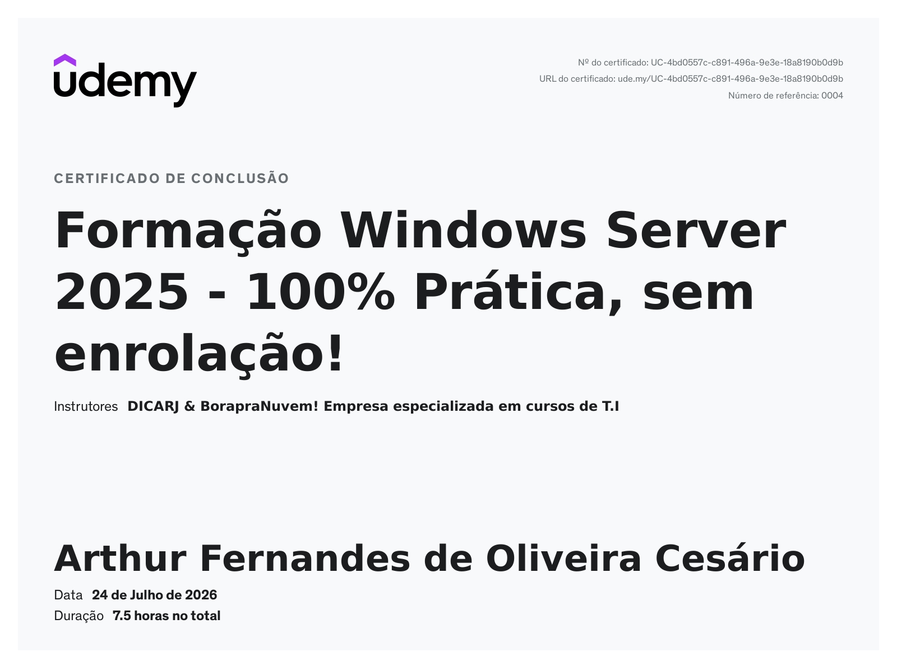

# Certificados
Este repositório reúne os certificados dos cursos concluídos durante minha formação em Tecnologia da Informação.

| Curso | Instituição |
|--------|-------------|
| Windows Server 2025 | Udemy |
| Redes de Computadores TCP/IP e Wireshark | Udemy |
| Cibersegurança | Udemy |
| GNU/Linux | Udemy |
| Networking Basics | Cisco Networking Academy |
| Git & GitHub | Cursa |

---

## Windows Server 2025

  

---

## Redes de Computadores TCP/IP e Wireshark

  

---

## Cibersegurança

  

---

## GNU/Linux

  

---

## Networking Basics

  

---

## Git & GitHub

  

