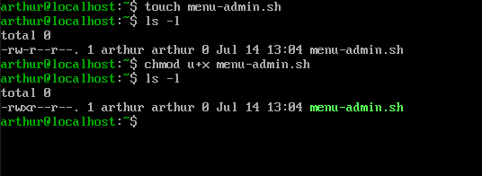
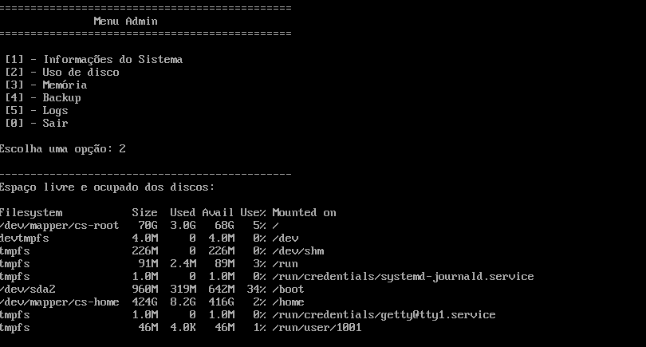
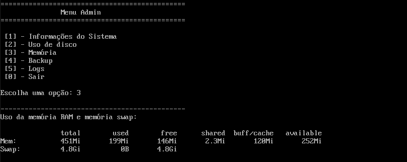
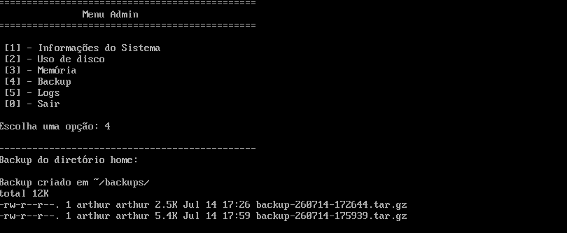
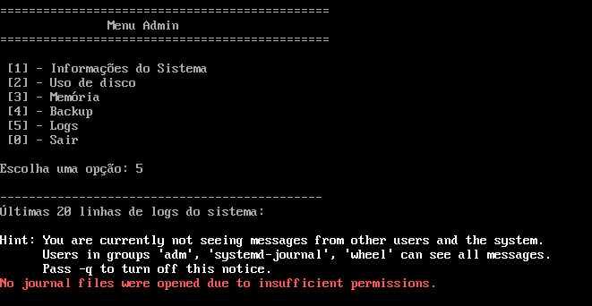
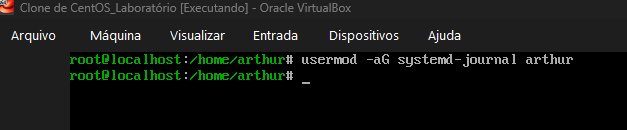
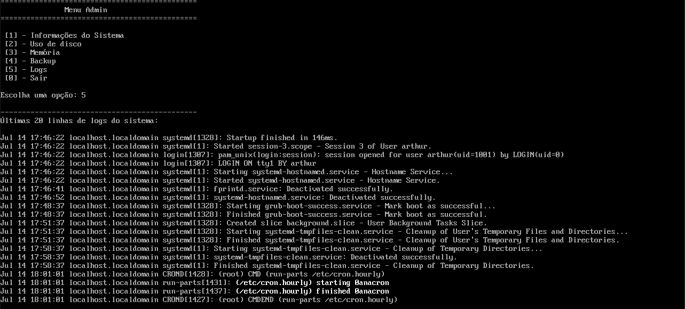

<h1 align="center">Menu Admin: Script de Administração de Sistemas em Bash</h1>


## Objetivo
Nesse laboratório comecei a estudar Bash criando um script interativo em formato de menu para reunir tarefas comuns de administração do Linux, como consultar informações do sistema, verificar uso de disco e memória, criar backups e visualizar logs.

## Tecnologias utilizadas
- Oracle VirtualBox
- CentOS
- Bash

## Criação do arquivo
Criei o script com `touch` e ajustei a permissão de execução com `chmod u+x`.



## Desenvolvimento do script
Usei o editor `vim` para desenvolver o script.


---

## Código do script
```bash
#!/bin/bash

# Criando ferramenta de administração de sistemas

opcao="x"

# Loop de repetição
while [ "$opcao" != "0" ]; do
    echo "=============================================="
    echo "                 Menu Admin                   "
    echo "=============================================="
    echo
    echo "[1] - Informações do Sistema"
    echo "[2] - Uso de disco"
    echo "[3] - Memória"
    echo "[4] - Backup"
    echo "[5] - Logs"
    echo "[0] - Sair"
    echo

    # Escolha do usuário
    read -p "Escolha uma opção: " opcao
    echo
    echo "----------------------------------------------"

    # Informações do sistema
    if [ "$opcao" = "1" ]; then
        echo "Informações do sistema:"
        echo
        echo "Hostname:"
        hostname
        echo
        echo "Usuário:"
        whoami
        echo
        echo "Kernel:"
        uname -r
        echo

    # Uso de disco
    elif [ "$opcao" = "2" ]; then
        echo "Espaço livre e ocupado dos discos:"
        echo
        df -h
        echo

    # Memória
    elif [ "$opcao" = "3" ]; then
        echo "Uso da memória RAM e memória swap:"
        echo
        free -h
        echo

    # Backup
    elif [ "$opcao" = "4" ]; then
        echo "Backup do diretório home:"
        echo
        mkdir -p ~/backups
        tar -czf ~/backups/backup-$(date +%Y%m%d-%H%M%S).tar.gz -C /home arthur
        echo "Backup criado em ~/backups/"
        ls -lh ~/backups
        echo

    # Logs
    elif [ "$opcao" = "5" ]; then
        echo "Últimas 20 linhas de logs do sistema:"
        echo
        journalctl -n 20
        echo

    # Sair
    elif [ "$opcao" = "0" ]; then
        exit

    # Opção inválida
    else
        echo
        echo "Opção inválida!"
        echo
    fi
done
```

---

## Testando as opções

**Opção 1, Informações do Sistema:** mostra hostname, usuário logado e versão do kernel.


---

**Opção 2, Uso de disco:** roda `df -h` para mostrar espaço livre e ocupado.



---

**Opção 3, Memória:** roda `free -h` para mostrar uso de RAM e swap.



---

**Opção 4, Backup:** compacta o diretório home num `.tar.gz` com timestamp, salvo em `~/backups`.



Nesse teste dá pra ver dois arquivos de backup já acumulados em `~/backups`, cada um com timestamp diferente. Isso confirma que o `mkdir -p` não recria nem duplica a pasta a cada execução, só garante que ela exista. Quem gera um arquivo novo por vez é o `tar`.

---

## Erro na opção 5
Ao testar a opção 5 (Logs), o `journalctl -n 20` falhou:
```
No journal files were opened due to insufficient permissions.
```



A causa: por padrão, só usuários dos grupos `adm`, `systemd-journal` ou `wheel` (ou root) conseguem ler os arquivos de journal do systemd. O usuário comum que eu estava usando não fazia parte de nenhum desses grupos.

## Solução
Resolvi adicionando o usuário ao grupo `systemd-journal`:
```bash
usermod -aG systemd-journal arthur
```



Depois de relogar (para sessão pegar a nova associação de grupo), a opção 5 passou a funcionar sem precisar de `sudo`.



---

## Testando opção inexistente
Testei uma opção fora do menu para confirmar que o `else` trata isso direito, mostra "Opção inválida!" e o loop continua, sem quebrar o script.


---

## Conclusão
Esse laboratório foi meu primeiro contato com Bash Script. A lógica de loop, condicional e leitura de entrada eu já tinha de outros estudos em programação, mas aprender a sintaxe específica do Bash, e principalmente aplicar isso em cima de comandos reais do Linux, foi a parte nova pra mim. O ponto mais interessante foi o erro da opção 5, porque não é um erro de sintaxe do script, é uma questão de permissão do sistema. O `journalctl` restringe leitura de log por grupo, não só por root, e resolver isso me fez entender melhor como o systemd protege esses arquivos por padrão.

Também aprendi que `mkdir -p` é seguro de rodar toda vez, mesmo se a pasta já existir, e que usar `tar -C <dir> <alvo>` evita guardar caminho absoluto dentro do backup, o que é mais portável se eu precisar restaurar isso em outra máquina.

## Autor
**Arthur Fernandes**

Estudante de Ciência da Computação

Focado em Infraestrutura, Redes de Computadores e GNU/Linux.

**LinkedIn:**
[Arthur Fernandes](https://www.linkedin.com/in/arthur-fernandes-289395272)
