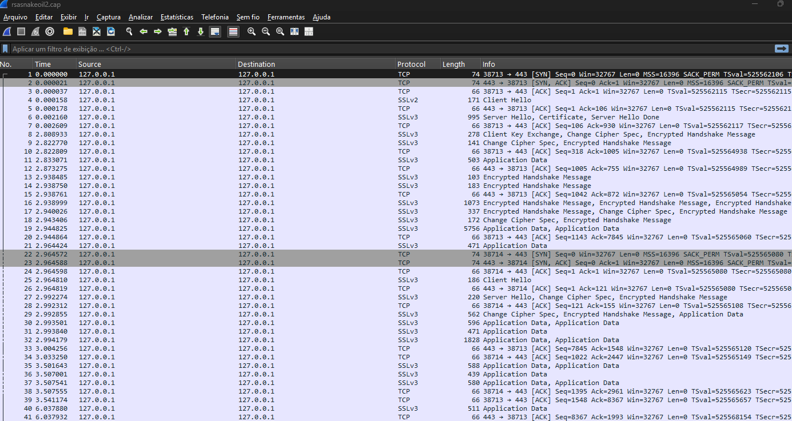
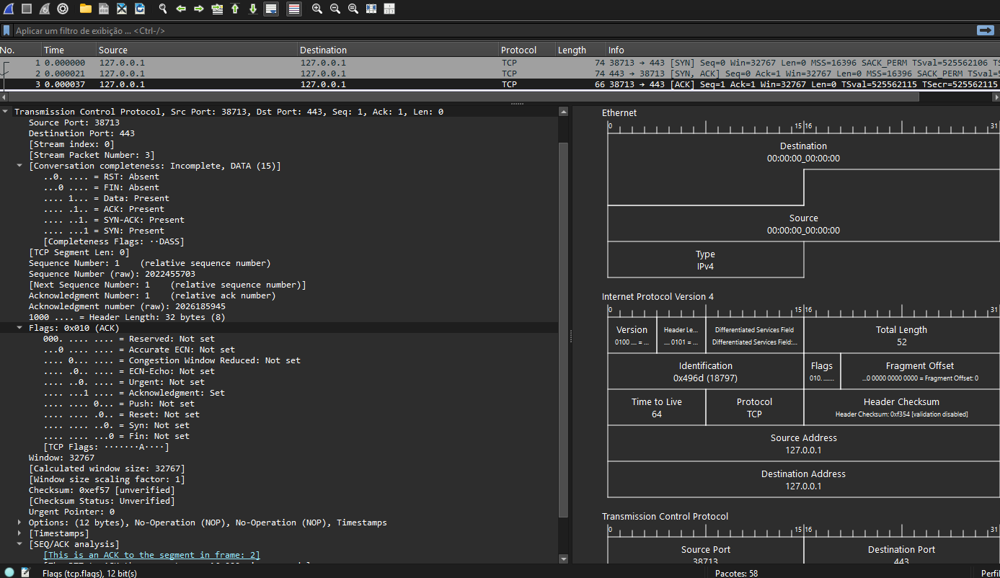
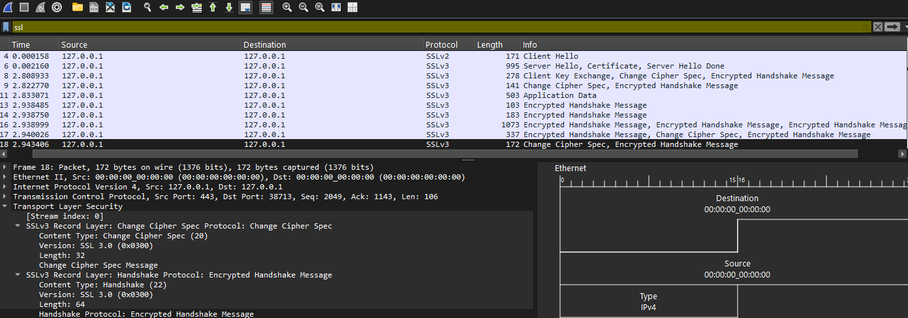
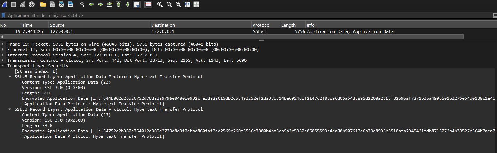
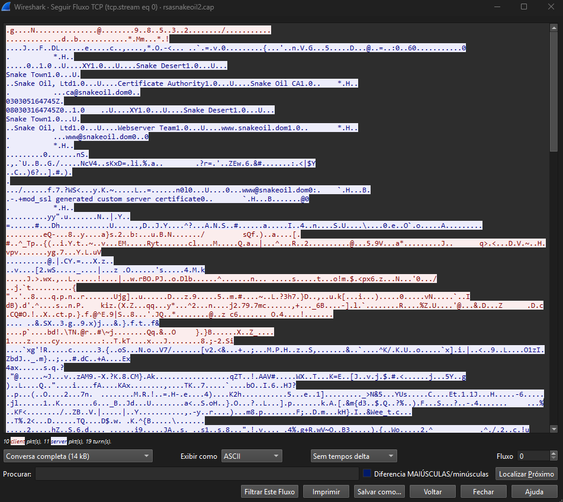
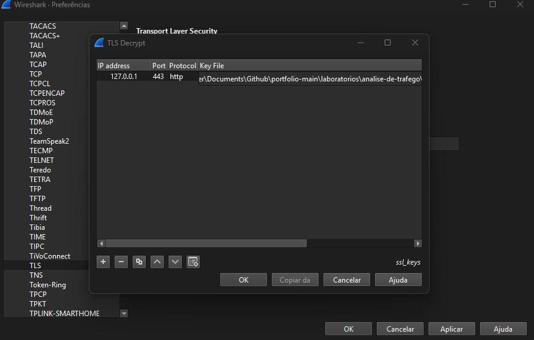
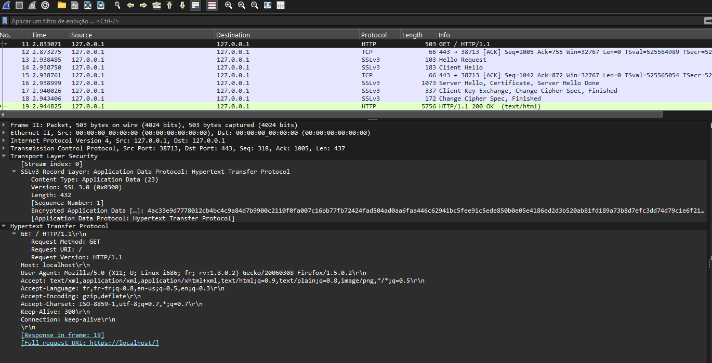
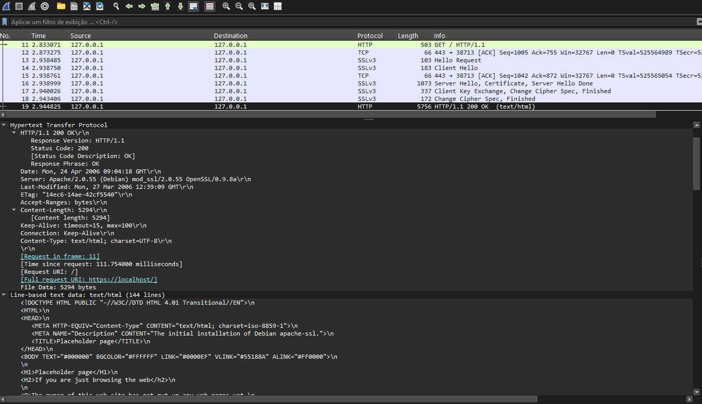
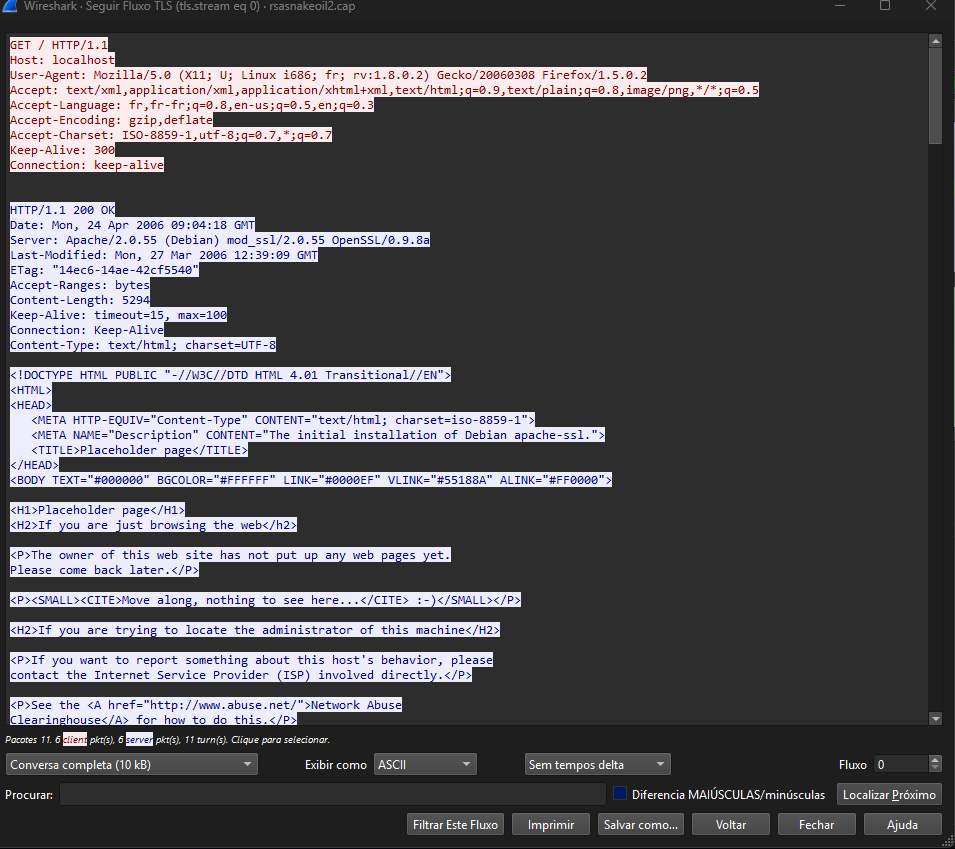
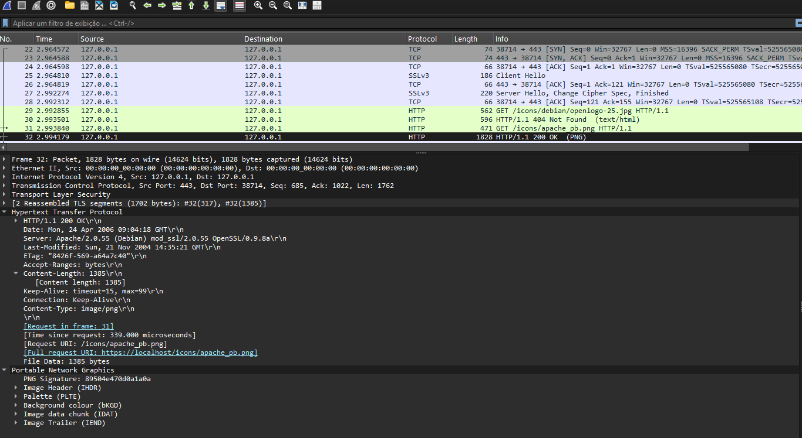

<h1 align="center">Análise de Navegação HTTPS com Wireshark</h1>

## Objetivo
Neste laboratório tive como objetivo analisar uma captura de navegação HTTPS, acompanhando o handshake TCP, o handshake SSL/TLS, a decriptação do tráfego via chave privada RSA e a requisição/resposta HTTP que fica visível depois da decriptação.

## Metodologia
Usei um arquivo de captura de referência da comunidade Wireshark, que já vem acompanhado da chave privada RSA usada no laboratório.

- **Fonte:** https://wiki.wireshark.org/samplecaptures
- **Arquivo usado:** [`rsasnakeoil2.cap`](./rsasnakeoil2.cap)
- **Chave privada:** [`snakeoil2.key`](./snakeoil2.key)

`Arquivos disponíveis para download neste repositório.`

## Tecnologias utilizadas

- Wireshark
- TCP
- SSL/TLS
- HTTP
- RSA

## Visão geral da captura
Abri o arquivo sem filtro nenhum para ter uma visão geral do tráfego antes de começar a análise.

Reparei que origem e destino aparecem sempre como `127.0.0.1`, o endereço de loopback. Tráfego para esse IP nunca sai da máquina, vai da aplicação para a pilha de rede local e volta, sem passar por nenhuma interface física. Isso indica que a captura foi gerada com cliente e servidor rodando na mesma máquina, ou que os IPs reais foram trocados por loopback antes de a captura ser disponibilizada para a comunidade.

<p align="center">

</p>

---

## Three-Way Handshake
Os primeiros três pacotes da captura são o handshake com o servidor na porta 443:
- **SYN:** o cliente pede para abrir a conexão.
- **SYN, ACK:** o servidor confirma e também quer conectar.
- **ACK:** o cliente confirma, e a conexão fica estabelecida.

<p align="center">

</p>

---

## Handshake SSL/TLS
Com a conexão TCP estabelecida, começa a negociação.
```
Client Hello
Server Hello, Certificate, Server Hello Done
Client Key Exchange, Change Cipher Spec, Encrypted Handshake Message
Change Cipher Spec, Encrypted Handshake Message
Encrypted Handshake Message (trocas adicionais)
```

O Wireshark identifica o protocolo como **SSLv3**, e não TLS. SSL 3.0 é o antecessor direto do TLS. Hoje o SSLv3 é considerado obsoleto e inseguro (vulnerável a ataques), por isso só aparece em capturas de referência como essa, nunca em tráfego atual.


<p align="center">

</p>

---

## Application Data criptografado
Sem carregar a chave privada, o pacote 19 `(Application Data)` aparece com o conteúdo completamente ilegível.

<p align="center">

</p>

Segui o fluxo TCP completo dessa conversa (`tcp.stream eq 0`) pra visualizar melhor. Boa parte do conteúdo está criptografado, mas no início do fluxo dá pra ver alguns trechos legíveis, como `Snake Oil, Ltd`, `Certificate Authority` e `www@snakeoil.dom`. Isso não é dado decriptado, é o certificado digital do servidor que trafega em texto claro durante o handshake (pacote 6).

<p align="center">

</p>

---

## Configuração da chave RSA para decriptação
Carreguei a chave privada em **Editar → Preferências → Protocols → TLS → RSA keys list**, informando:
- **IP:** `127.0.0.1`
- **Porta:** `443`
- **Protocol:** `http`
- **Key File:** o arquivo `snakeoil2.key`

<p align="center">

</p>

---

## Requisição e resposta HTTP decriptadas
Com a chave aplicada, o Wireshark passou a decriptar automaticamente os pacotes `Application Data` dessa sessão. No pacote 11, a requisição do cliente ficou legível:
```
GET / HTTP/1.1
Host: localhost
```

<p align="center">

</p>

E no pacote 19, a resposta completa do servidor:
```
HTTP/1.1 200 OK
Server: Apache/2.0.55 (Debian) mod_ssl/2.0.55 OpenSSL/0.9.8a
Content-Type: text/html; charset=UTF-8
```

<p align="center">

</p>

Segui essa mesma conexão usando **Follow TLS Stream**:

<p align="center">

</p>

---

## Segunda conexão TLS
A captura tem uma segunda sessão TCP/TLS completa mais adiante (porta de origem 38714), com seu próprio three-way handshake e handshake SSL/TLS independentes. Depois de carregar a página principal, o navegador buscou outros recursos referenciados nela:

- `GET /icons/debian/openlogo-25.jpg` → **404 Not Found** (o recurso não existe no servidor)
- `GET /icons/apache_pb.png` → **200 OK** (imagem PNG carregada com sucesso)

Isso mostra o navegador buscando recursos adicionais da página depois do HTML principal, sendo que um deles falha.

<p align="center">

</p>

---

## Encerramento da conexão
Diferente do lab anterior, essa captura não inclui o encerramento da conexão (FIN/ACK). O arquivo parece ter sido interrompido logo após a troca de dados, sem registrar o fechamento da sessão.

## Conclusão
Esse lab me ajudou a entender na prática a diferença entre analisar HTTP puro e HTTPS. Sem a chave privada, todo o `Application Data` fica ilegível, restando visível só o que realmente precisa trafegar em texto claro, como o certificado do servidor durante o handshake. Depois de carregar a chave RSA correta, o Wireshark decripta a sessão automaticamente e dá pra ver exatamente a mesma requisição e resposta HTTP que estariam visíveis num lab de HTTP simples, só que agora escondidas dentro de uma camada TLS.

Também entendi que o protocolo da captura é SSLv3. Ao pesquisar, aprendi que ele é o antecessor do TLS. Hoje esse protocolo está obsoleto e não aparece mais em tráfego real. A segunda conexão TLS, com o navegador buscando recursos adicionais da página (um deles retornando 404), reforçou como uma navegação HTTPS "simples" na verdade envolve várias conexões e requisições separadas.

## Autor
**Arthur Fernandes**

Estudante de Ciência da Computação

Focado em Infraestrutura, Redes de Computadores e GNU/Linux.

**LinkedIn:**
[Arthur Fernandes](https://www.linkedin.com/in/arthur-fernandes-289395272)
