<h1 align="center">NAT Overload (PAT): Matriz e Filial</h1>

## Objetivo
Neste laboratório dei continuidade ao lab de [Roteamento Estático: Interligação de Filial via ISP](https://github.com/arthurfernandes97/portfolio/tree/main/laboratorios/laboratorios-redes/04-roteamento-estatico-matriz-filial-isp), reaproveitando a mesma topologia para configurar NAT Overload (PAT) na Matriz e na Filial, permitindo que as duas unidades tenham acesso à internet usando um único IP público cada, sem perder a comunicação direta entre Matriz e Filial.

## Tecnologias utilizadas

- Cisco Packet Tracer
- NAT Overload (PAT)
- Access Control List (ACL) Estendida
- Roteamento estático
- ICMP (Ping)

## Topologia

Reaproveitei a topologia dos laboratórios anteriores.

- **VLAN 10** - Vendas - 172.16.10.0/24
- **VLAN 20** - Administração - 172.16.20.0/24
- **VLAN 30** - TI - 172.16.30.0/24
- **VLAN 40** - Servidor - 172.16.40.0/24
- **Filial** - 192.168.50.0/24

<p align="center">
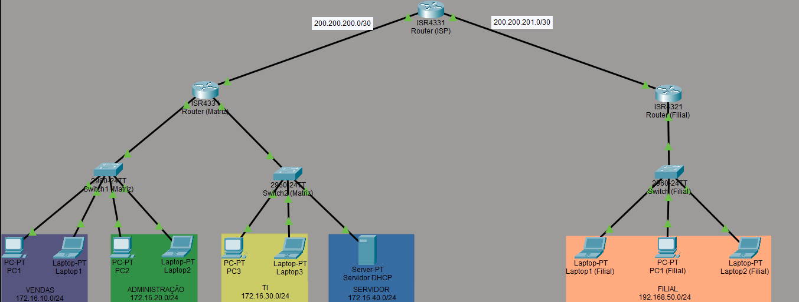
</p>

---

## Simulando a internet

Antes de configurar qualquer coisa, precisava de um jeito de provar que o NAT estava traduzindo de verdade. A Matriz e a Filial já se enxergam direto desde o laboratório de roteamento estático, então pingar de um para o outro não prova nada sobre NAT.

Adicionei uma interface loopback no roteador do ISP com o IP `8.8.8.8/32`, simulando um destino externo qualquer. Esse endereço passou a ser meu alvo de teste pra internet.

<p align="center">
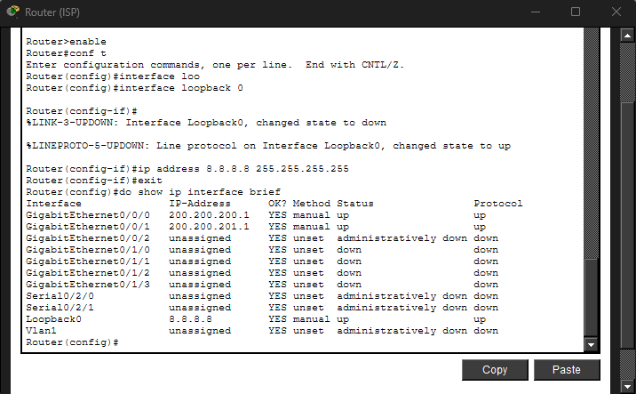
</p>

---

## Marcando as interfaces inside e outside

Na Matriz, o roteador tem três interfaces físicas: `Gig0/0/0` e `Gig0/0/1` levando pras VLANs (com subinterfaces por VLAN), e `Gig0/0/2` ligada ao ISP. Marquei as quatro subinterfaces como `ip nat inside` e a interface do ISP como `ip nat outside`.

Na Filial é mais direto, só uma interface de LAN (inside) e uma de saída pro ISP (outside).

<p align="center">
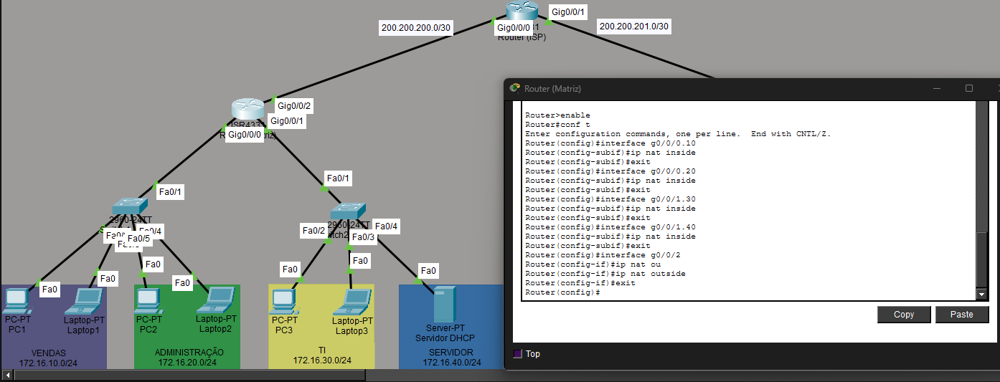
</p>

<p align="center">
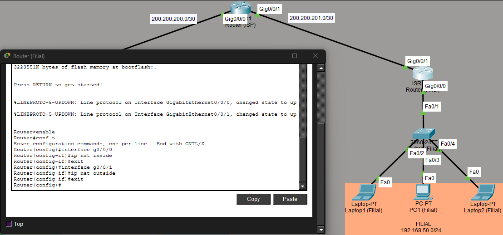
</p>

---

## ACL de exclusão e NAT Overload

Esse foi o ponto que mais me confundiu no laboratório. Se eu simplesmente ativasse o NAT overload sem nenhuma restrição, o roteador ia traduzir também o tráfego entre Matriz e Filial, que já é roteado direto e não devia passar por tradução nenhuma.

A solução foi uma ACL estendida que nega o tráfego destinado ao outro site e permite o resto. Na Matriz:

```
access-list 100 deny ip 172.16.0.0 0.0.255.255 192.168.50.0 0.0.0.255
access-list 100 permit ip 172.16.0.0 0.0.255.255 any
ip nat inside source list 100 interface GigabitEthernet0/0/2 overload
```

Na Filial, a mesma lógica invertida:

```
access-list 100 deny ip 192.168.50.0 0.0.0.255 172.16.0.0 0.0.255.255
access-list 100 permit ip 192.168.50.0 0.0.0.255 any
ip nat inside source list 100 interface GigabitEthernet0/0/1 overload
```

<p align="center">
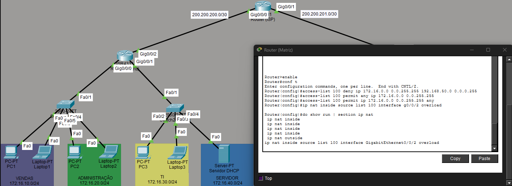
</p>

<p align="center">
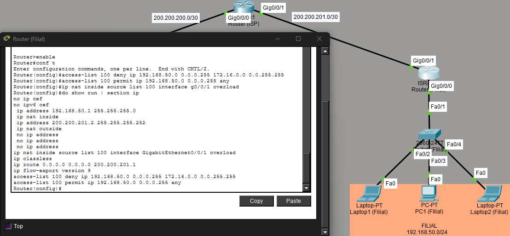
</p>

---

## Testando a tradução

Primeiro, testei o ping de um host da Filial até `8.8.8.8`. O `show ip nat translations` mostrou 4 entradas, uma por requisição ICMP, todas com o mesmo IP público da Filial mas portas diferentes.

<p align="center">
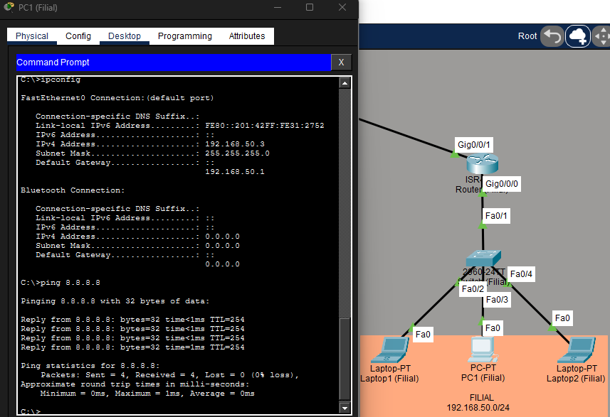
</p>

<p align="center">
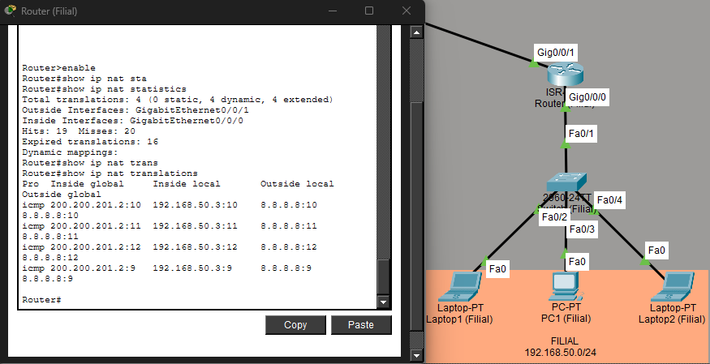
</p>

Na minha primeira tentativa de capturar esse print, a tabela apareceu vazia mesmo com o ping tendo funcionado. O timeout padrão do NAT pra ICMP é curto, e a tradução já tinha expirado antes de eu rodar o comando. Refiz o teste rodando os dois comandos em sequência, sem pausa, e consegui capturar a tabela ainda ativa.

Depois, testei o ping de um host da Filial até um host da Matriz. A tabela de NAT continuou sem nenhuma entrada nova, confirmando que esse tráfego não passa pela tradução.

<p align="center">
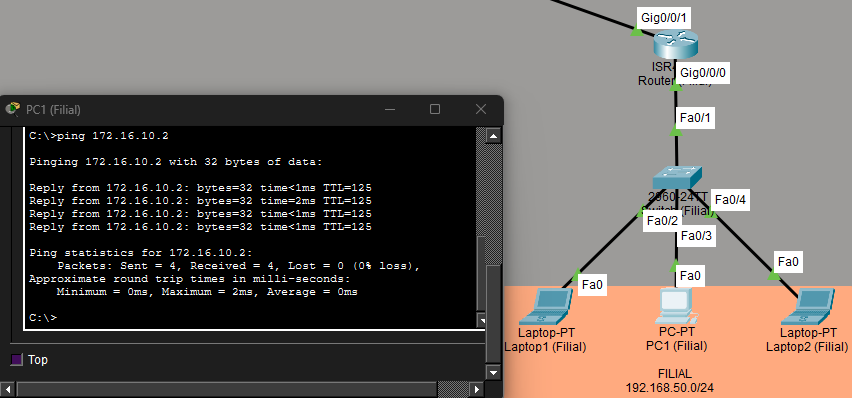
</p>

<p align="center">
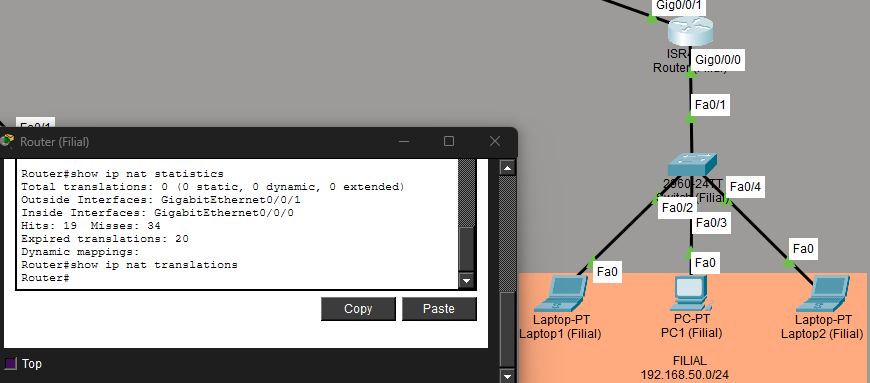
</p>

Repeti os dois testes em um host da Matriz.

<p align="center">
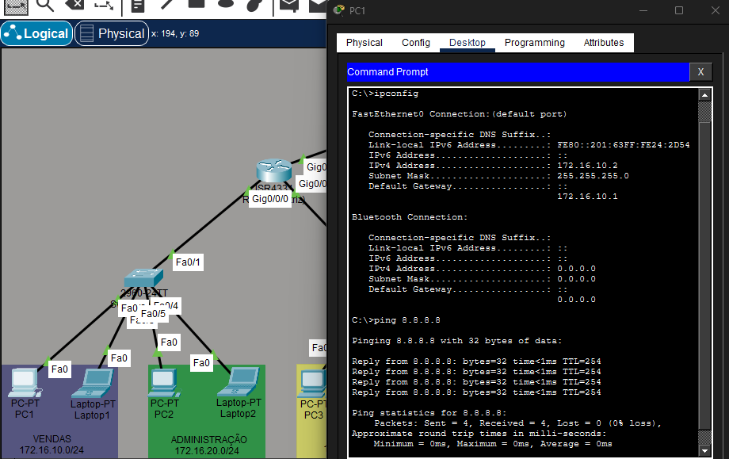
</p>

<p align="center">
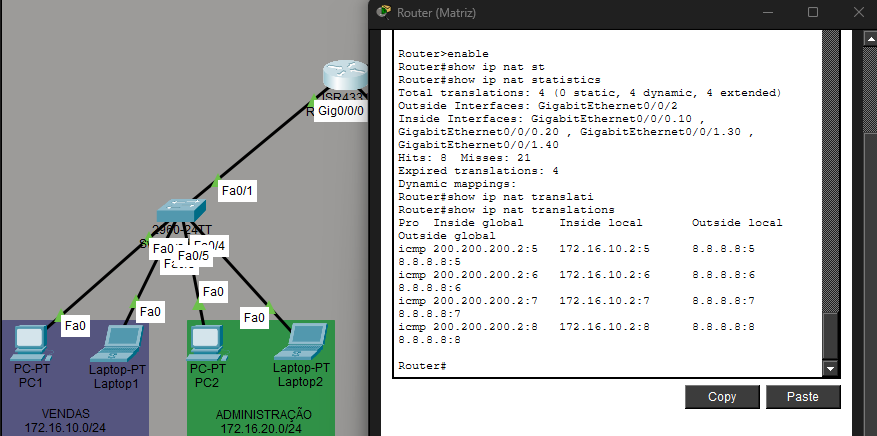
</p>

<p align="center">
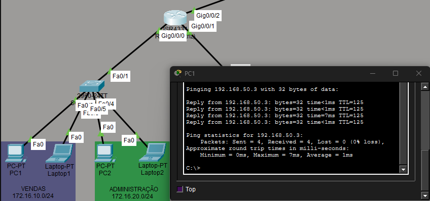
</p>

<p align="center">
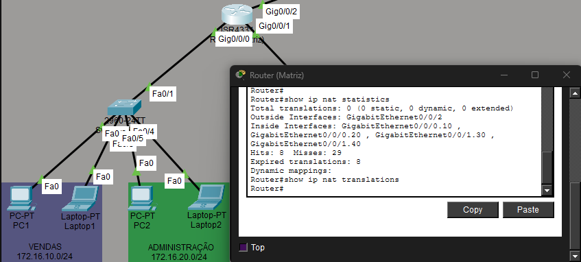
</p>

---

## Conclusão

Esse laboratório me ajudou a entender NAT de um jeito mais concreto do que só a definição de "traduzir IP privado pra público". O que muda entre os hosts que compartilham o mesmo IP público não é o endereço, é o socket, a combinação de IP e porta, e é por isso que a tabela de tradução guarda os quatro campos (IP local, porta local, IP global, porta global) em vez de só o par de IPs.

O ponto mais importante foi a ACL de exclusão. Sem ela, o NAT ia traduzir também o tráfego entre Matriz e Filial, quebrando algo que já funcionava desde o laboratório de roteamento estático. Configurar Matriz e Filial com a mesma lógica, apenas invertendo as redes na ACL, garantiu que os dois sites continuassem se enxergando pelos IPs privados, enquanto apenas o tráfego destinado à internet era traduzido.

## Arquivos do laboratório

Caso queira reproduzir a configuração, o arquivo do Cisco Packet Tracer está disponível para download neste diretório.

- [lab-nat-overload-matriz-filial.pkt](./lab-nat-overload-matriz-filial.pkt)

## Autor

**Arthur Fernandes**

Estudante de Ciência da Computação, em transição de carreira para a área de TI (Suporte Técnico, Infraestrutura, Redes e NOC).

**LinkedIn:**
[Arthur Fernandes](https://www.linkedin.com/in/arthur-fernandes-289395272)
