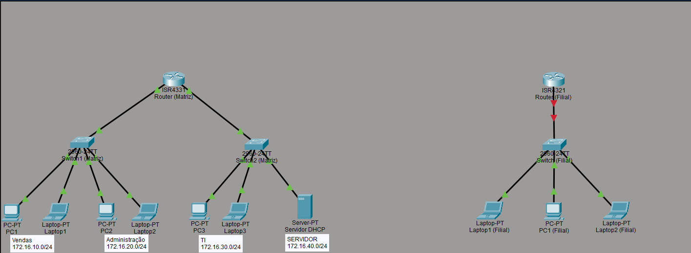

<h1 align="center">Roteamento Estático: Interligação de Filial via ISP</h1>

## Objetivo
Neste laboratório dei continuidade à estrutura de rede dos projetos anteriores para interligar a Matriz a uma nova unidade remota (Filial), utilizando roteamento estático através de um roteador que simula um ISP.

## Tecnologias utilizadas

- Cisco Packet Tracer
- Roteamento estático 
- VLANs
- Access Control List (ACL)
- ICMP (Ping / Tracert)

## Topologia

Reaproveitei a topologia de VLANs, configuradas nos laboratórios anteriores (Vendas, Administração, TI e servidor).

- **VLAN 10** - Vendas - 172.16.10.0/24
- **VLAN 20** - Administração - 172.16.20.0/24
- **VLAN 30** - TI - 172.16.30.0/24
- **VLAN 40** - Servidor - 172.16.40.0/24


<p align="center">

</p>

---

## Montando a Filial

Montei a Filial isolada (roteador, switch, 1 PC e 2 notebooks) para validar a rede local por conta própria.

 - **Topologia Filial**
<p align="center">

</p>

- **Configuração do roteador da Filial**
<p align="center">

</p>

- **Definindo IPs da Filial**
<p align="center">

</p>

- **Teste de conectividade**
 
Testei o ping de cada host até o gateway e os hosts entre si, todos com 0% de perda.

<p align="center">

</p>

---

## Configurando o roteador ISP
Adicionei o roteador entre a Matriz e a Filial para simular o provedor (ISP).

<p align="center">

</p>

- **Configurações das interfaces dos roteadores (ISP e Matriz)**

<p align="center">

</p>

- **Configurações das interfaces dos roteadores (ISP e Filial)**

<p align="center">

</p>

---

## Configurando as rotas estáticas

Nos roteadores de ponta (Matriz e Filial) configurei uma rota default apontando para o ISP, já que qualquer rede fora da LAN precisa passar por ele. No ISP, configurei rotas específicas para cada rede interna, pois é ele quem conhece o caminho entre a Matriz e a Filial.

```
# Matriz
ip route 0.0.0.0 0.0.0.0 200.200.200.1

# Filial
ip route 0.0.0.0 0.0.0.0 200.200.201.1

# ISP
ip route 172.16.10.0 255.255.255.0 200.200.200.2
ip route 172.16.20.0 255.255.255.0 200.200.200.2
ip route 172.16.30.0 255.255.255.0 200.200.200.2
ip route 172.16.40.0 255.255.255.0 200.200.200.2
ip route 192.168.50.0 255.255.255.0 200.200.201.2
```

<p align="center">

</p>

---

## Teste de conectividade

- **Teste de conectividade entre a Matriz e a Filial com ping e tracert**

<p align="center">

</p>

- **Teste de conectividade entre a Filial e a Matriz com ping**

<p align="center">

</p>

Ao testar a conectividade com a Filial, percebi que os hosts remotos também conseguiam acessar o servidor (172.16.40.0/24), e lembrei que isso não deveria acontecer, já que em um dos laboratórios anteriores [(ACL entre VLANs: Restrição de Acesso ao Servidor)](https://github.com/arthurfernandes97/portfolio/tree/main/laboratorios/laboratorios-redes/03-acl-restricao-servidor), a minha intenção era restringir esse acesso apenas à VLAN de TI.


---

## Corrigindo a ACL 

Revendo a ACL antiga, percebi que ela bloqueava apenas as VLANs Vendas e Administração e liberava todo o restante no final (`permit ip any any`). Qualquer origem nova, como a Filial, não estava na lista de bloqueio e por isso passava direto. 

Corrigi isso criando uma ACL que permite apenas a VLAN de TI acessar o servidor, bloqueia qualquer outra origem e libera o restante do tráfego normalmente. Em vez de aplicar a ACL nas VLANs de origem, apliquei diretamente na subinterface do servidor. Dessa forma qualquer tráfego destinado ao servidor é obrigado a passar por essa ACL, inclusive se novas redes forem adicionadas futuramente.

```
access-list 130 permit ip 172.16.30.0 0.0.0.255 172.16.40.0 0.0.0.255
access-list 130 deny ip any 172.16.40.0 0.0.0.255
access-list 130 permit ip any any
```

```
interface g0/0/1.40
ip access-group 130 out
```

<p align="center">

</p>

Testei os quatro cenários para validar a correção. Somente o PC3 (VLAN de TI) conseguiu acessar o servidor. Nos outros testes apareceu a mensagem `Destination Host Unreachable`, confirmando que a ACL estava funcionando.

<p align="center">

</p>

---

## Topologia final

- **VLAN 10** - Vendas - 172.16.10.0/24
- **VLAN 20** - Administração - 172.16.20.0/24
- **VLAN 30** - TI - 172.16.30.0/24
- **VLAN 40** - Servidor - 172.16.40.0/24
- **Filial** - 192.168.50.0/24
- **Link Matriz ↔ ISP** - 200.200.200.0/30
- **Link ISP ↔ Filial** - 200.200.201.0/30

<p align="center">

</p>

---

## Conclusão

Esse laboratório me mostrou como o roteamento estático se comporta numa topologia com mais de dois roteadores. Cada ponta só precisa de uma rota default apontando para o meio, enquanto o roteador central precisa conhecer o caminho detalhado de cada rede. Também entendi na prática a diferença entre uma sub-rede /24 de LAN e uma /30 usada só pra link ponto a ponto entre roteadores.

O ponto mais importante foi a correção da ACL. Uma ACL que bloqueia algumas origens e libera o resto no final não é a mesma coisa que uma ACL que permite só uma origem específica. A primeira deixa brecha pra qualquer rede nova que apareça depois, como aconteceu com a Filial. Além disso, aprendi que o lugar onde a ACL é aplicada importa tanto quanto a lógica dela. Ela precisa estar no ponto por onde todo o tráfego destinado ao servidor obrigatoriamente passa, não apenas na origem que motivou a regra originalmente.

## Autor

**Arthur Fernandes**

Estudante de Ciência da Computação, em transição de carreira para a área de TI (Suporte Técnico, Infraestrutura, Redes e NOC).

**LinkedIn:**
[Arthur Fernandes](https://www.linkedin.com/in/arthur-fernandes-289395272)
