<h1 align="center">Implantação Inicial de Ambiente Windows Corporativo Virtualizado</h1>

## Objetivo

Neste laboratório preparei um ambiente Windows corporativo utilizando duas máquinas virtuais: um servidor com Windows Server 2025 e uma estação de trabalho com Windows 11.

O objetivo foi preparar a infraestrutura que será utilizada nos próximos laboratórios de Active Directory, incluindo administração de usuários e grupos, Unidades Organizacionais (OUs), Group Policy (GPO), DNS, DHCP e outros recursos do Windows Server.

## Arquitetura do ambiente

| Máquina       | Sistema                                   | Função                                      |
| ------------- | ----------------------------------------- | ------------------------------------------- |
| **SRV-TI-01** | Windows Server 2025 Datacenter Evaluation | Controlador de Domínio (`arthurtech.local`) |
| **WKS-TI-01** | Windows 11 Pro                            | Estação de trabalho                         |

## Tecnologias utilizadas

* Windows Server 2025 Datacenter Evaluation
* Windows 11 Pro
* Oracle VirtualBox
* VirtualBox Guest Additions
* Active Directory Domain Services (AD DS)
* DNS
* Prompt de Comando (`ipconfig` e `ping`)

---

## Planejamento do ambiente

Antes de iniciar as instalações, defini como seria a estrutura do ambiente. Em vez de preparar o servidor e a estação como projetos separados, organizei as duas máquinas para formar um único ambiente.

O **SRV-TI-01** foi preparado como Controlador de Domínio do ambiente, enquanto a **WKS-TI-01** ficou responsável por validar autenticação no domínio, aplicação de políticas, permissões e outras configurações que serão implementadas nos próximos laboratórios.

---

## Etapa 1 - Criação e configuração da máquina virtual do servidor

Criei a máquina virtual **SRV-TI-01** utilizando a ISO oficial do Windows Server 2025. Configurei **4 GB de memória RAM**, **2 CPUs** e um **disco virtual dinâmico de 60 GB (VDI)**.

Também configurei duas placas de rede. A primeira em **NAT**, para acesso à Internet durante a instalação e atualização do sistema, e a segunda como **Rede Interna (Lan)**, que será utilizada para a comunicação entre o servidor e as máquinas clientes.

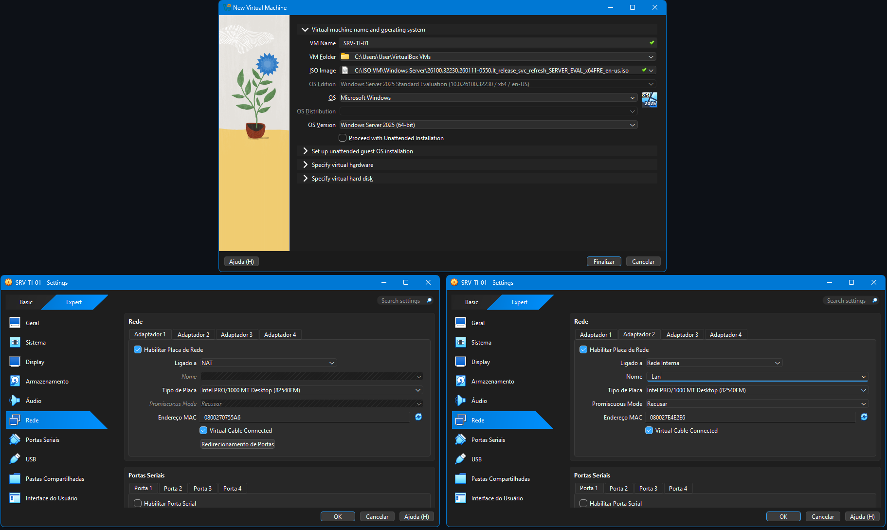

---

## Etapa 2 - Instalação e configuração inicial do servidor

Instalei o Windows Server 2025 Datacenter Evaluation (Desktop Experience) utilizando o particionamento automático do disco.

Depois da instalação concluída, instalei o **VirtualBox Guest Additions** e executei o **Windows Update** para deixar o servidor atualizado antes da instalação das funções do Windows Server.

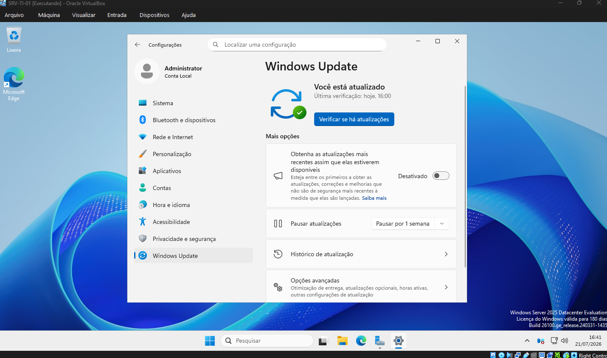

---

## Etapa 3 - Configuração da identidade e da rede

Com o sistema instalado, alterei o nome do servidor para **SRV-TI-01** e configurei um endereço IPv4 estático na interface da rede interna, já que um Controlador de Domínio deve possuir endereço IP fixo.

Depois utilizei os comandos **ipconfig /all** e **ping** para validar a configuração da rede.

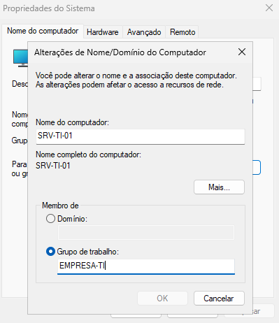

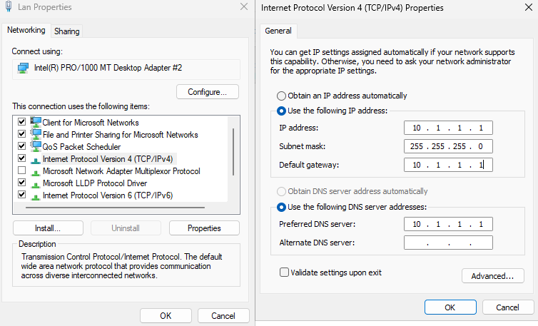

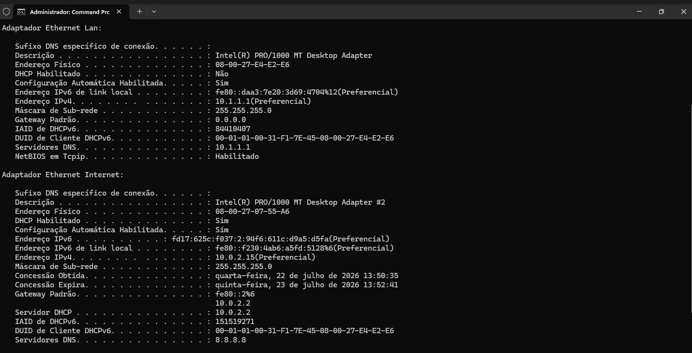

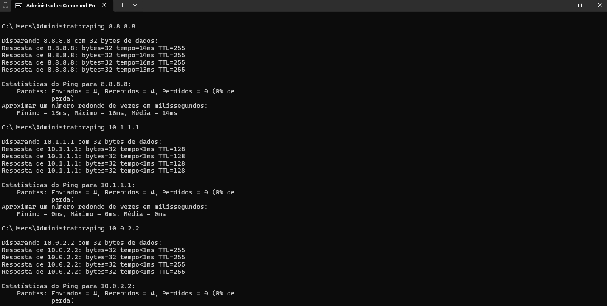

---

## Etapa 4 - Instalação do Active Directory

Com a configuração inicial concluída, utilizei o **Server Manager** para instalar a função **Active Directory Domain Services (AD DS)**.

Depois promovi o servidor a **Controlador de Domínio**, criando uma nova floresta chamada **arthurtech.local**.

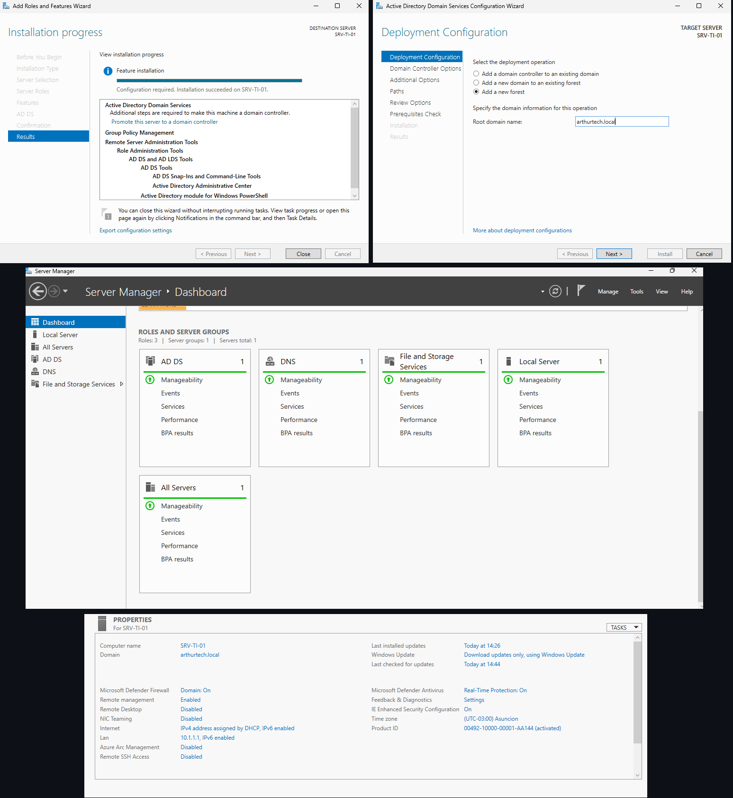

---

## Etapa 5 - Criação da máquina virtual da estação

Depois de concluir a configuração do servidor, criei a máquina virtual **WKS-TI-01** utilizando a ISO oficial do Windows 11 Pro.

Configurei **4 GB de memória RAM**, **2 CPUs** e um **disco virtual dinâmico de 60 GB (VDI)**. Também habilitei **EFI**, **TPM 2.0** e **Secure Boot**, requisitos exigidos para a instalação do Windows 11.

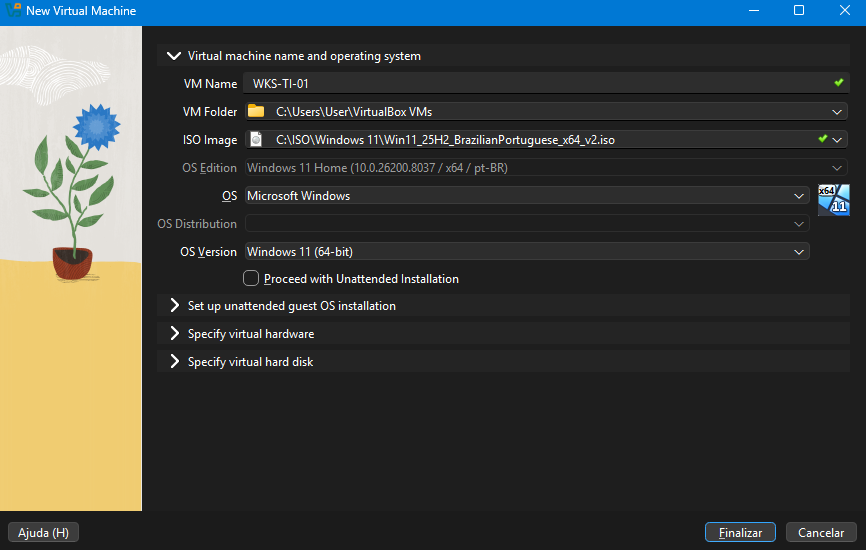

---

## Etapa 6 - Instalação e configuração da estação

Instalei o Windows 11, o **VirtualBox Guest Additions** e executei o **Windows Update**.

Depois configurei um endereço IPv4 estático na estação e defini como servidor DNS o endereço IP do **SRV-TI-01**, deixando a máquina pronta para ingressar no domínio.

Por fim, utilizei o comando **ping** para confirmar a comunicação com o servidor.

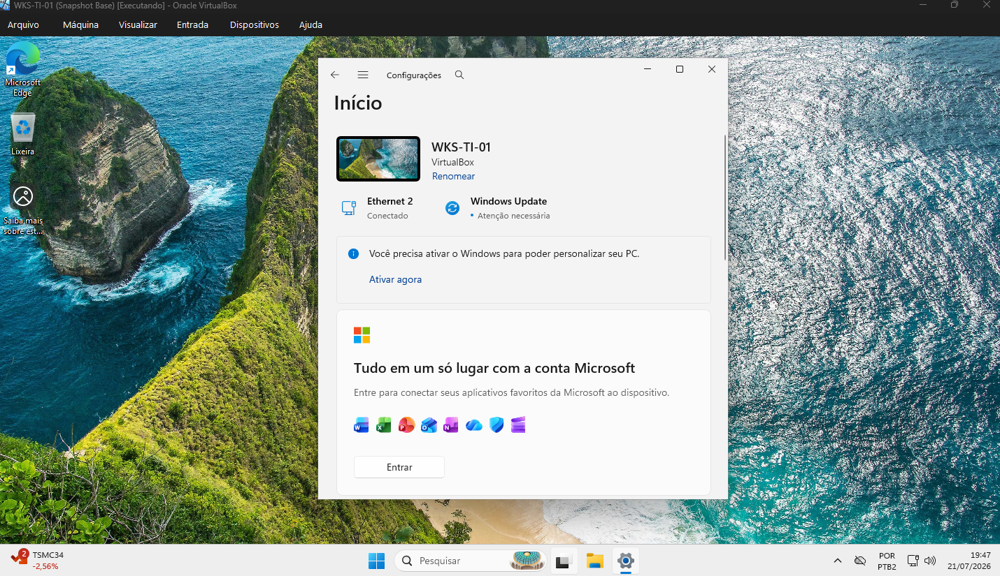

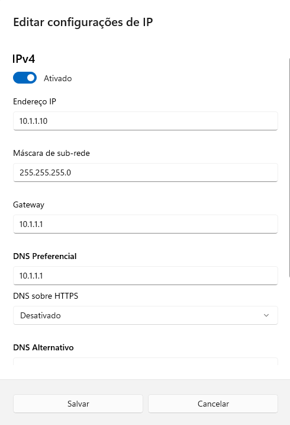

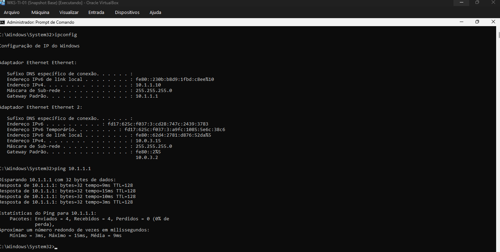

---

## Etapa 7 - Ingresso da estação no domínio

Com a configuração concluída, ingressei a **WKS-TI-01** no domínio **arthurtech.local**.

Com isso, a estação passou a fazer parte do domínio **arthurtech.local** e ficou pronta para os próximos laboratórios envolvendo Active Directory.

---

## Conclusão

Neste laboratório preparei a infraestrutura que será utilizada nos próximos projetos.

O **SRV-TI-01** ficou configurado como Controlador de Domínio do **arthurtech.local**, enquanto a **WKS-TI-01** foi configurada e ingressada no domínio.

A partir dessa base, os próximos laboratórios serão voltados para a administração do Active Directory, incluindo a criação de usuários e grupos, organização em Unidades Organizacionais (OUs), aplicação de Group Policy (GPO), configuração de DNS, DHCP e outros recursos do Windows Server.

## Autor

**Arthur Fernandes**

Estudante de Ciência da Computação, em transição de carreira para a área de TI (Suporte Técnico, Infraestrutura, Redes e NOC).

**LinkedIn:**
[Arthur Fernandes](https://www.linkedin.com/in/arthur-fernandes-289395272)
