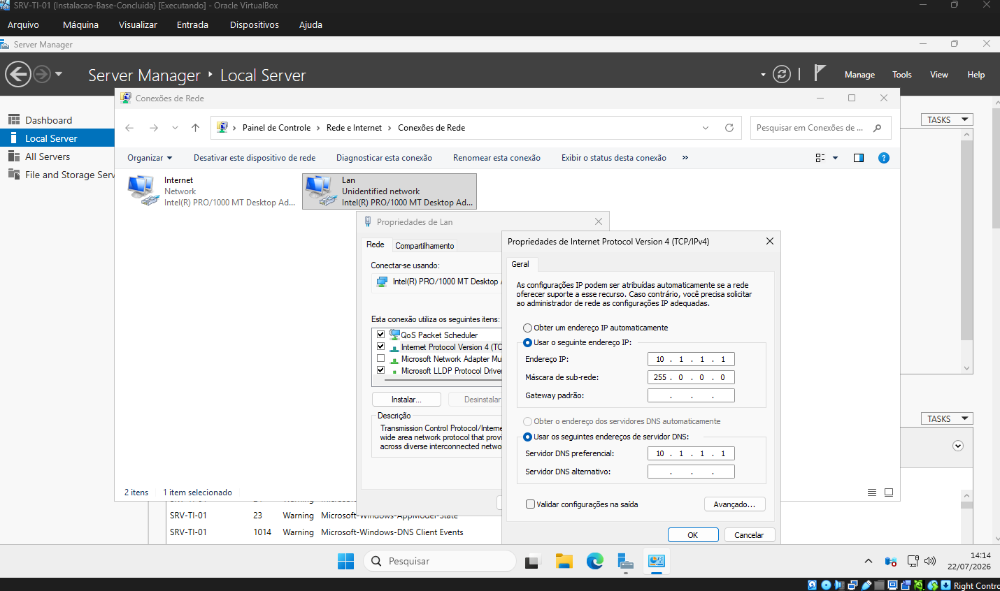
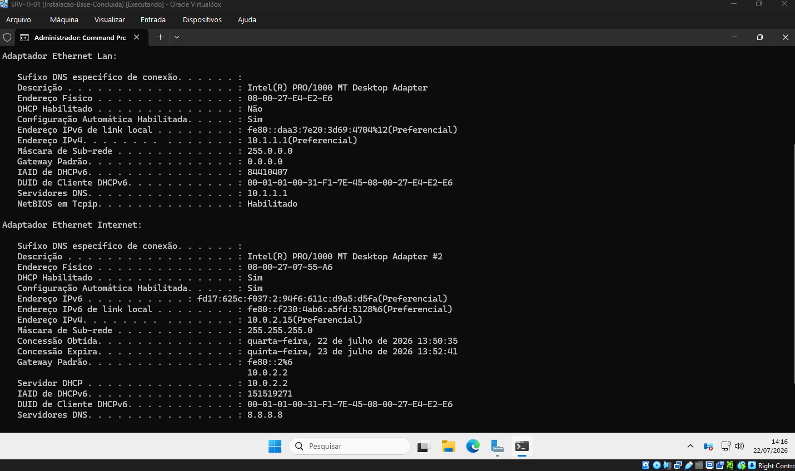
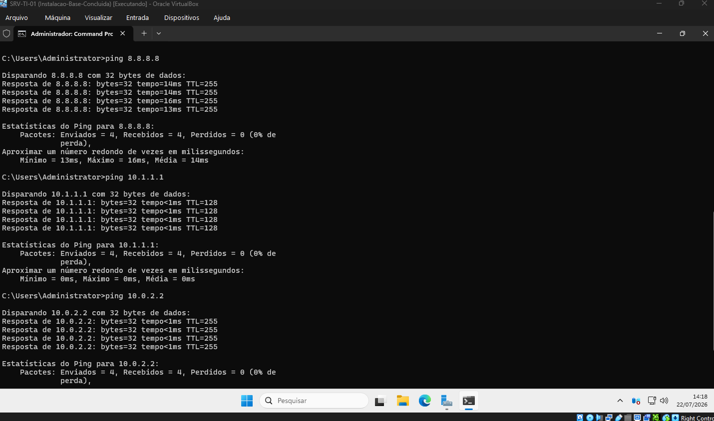
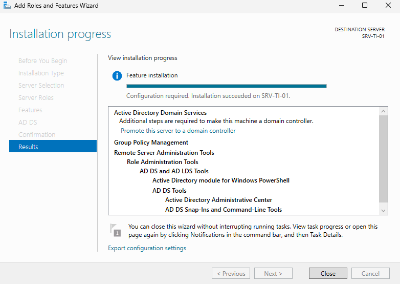
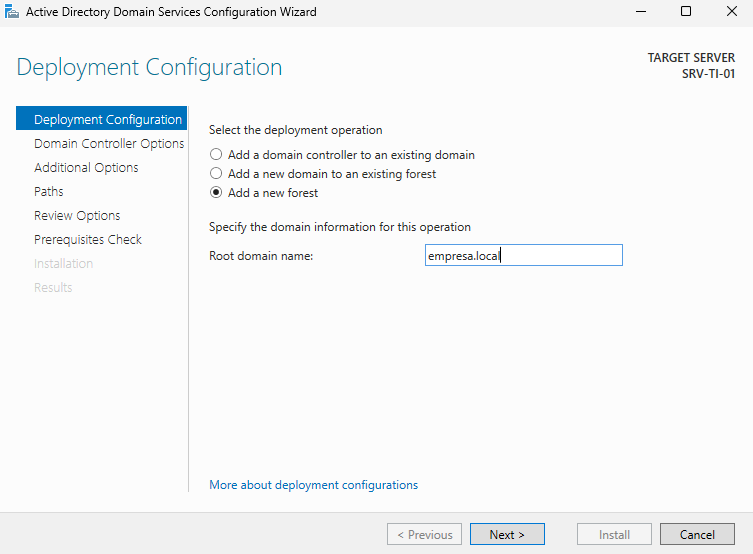
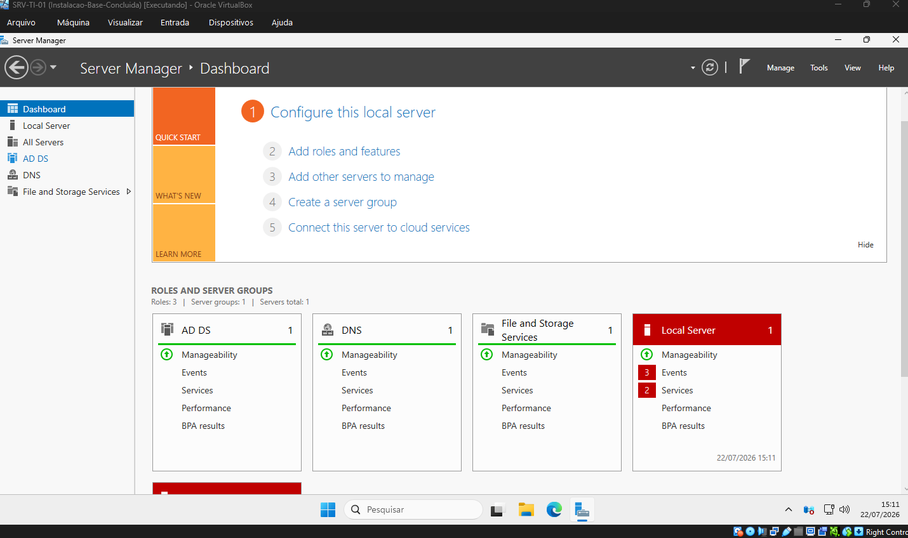
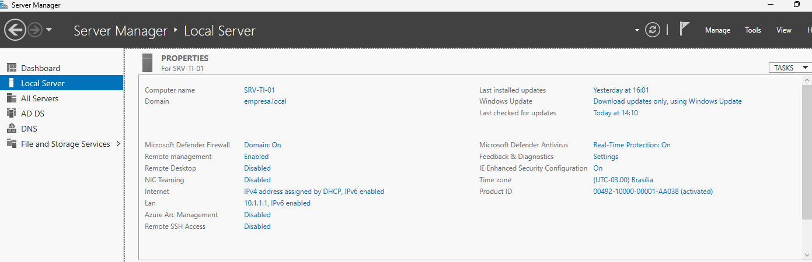
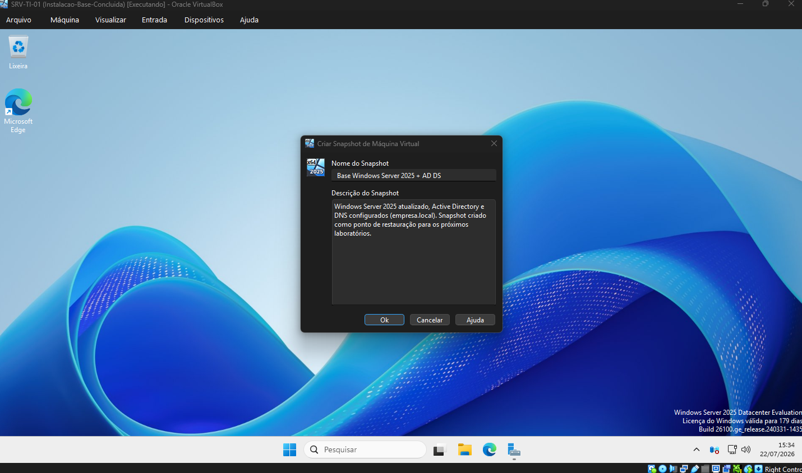

<h1 align="center">Instalação e Configuração Inicial de um Controlador de Domínio com Windows Server 2025</h1>

## Objetivo

Neste laboratório preparei uma máquina virtual com Windows Server 2025 utilizando o Oracle VirtualBox e realizei sua configuração inicial como Controlador de Domínio. O ambiente será utilizado nos próximos laboratórios para administração de usuários, grupos, políticas de grupo (Group Policy), DNS e outros recursos do Active Directory.

## Tecnologias utilizadas

- Windows Server 2025 Datacenter Evaluation
- Oracle VirtualBox
- VirtualBox Guest Additions
- Windows Update
- Active Directory Domain Services (AD DS)
- DNS

---

## Etapa 1 - Criação da Máquina Virtual

Criei uma máquina virtual com o nome **SRV-TI-01**, utilizando a ISO oficial do Windows Server 2025. Configurei **4 GB de memória RAM**, **2 CPUs** e um **disco virtual dinâmico de 60 GB (VDI)**.

---

## Etapa 2 - Configuração das Interfaces de Rede

Antes de iniciar a instalação configurei duas placas de rede na máquina virtual.

O primeiro adaptador foi configurado em **NAT**, permitindo acesso à Internet para instalação de atualizações.

O segundo adaptador foi configurado como **Rede Interna** com o nome **Lan**, que será utilizado para comunicação entre o servidor e as futuras máquinas clientes.

---

## Etapa 3 - Instalação do Windows Server

Após iniciar a máquina virtual utilizei o assistente de instalação para selecionar o idioma, escolher a edição **Windows Server 2025 Datacenter Evaluation (Desktop Experience)** e permitir que o instalador criasse automaticamente as partições do disco.

Depois da instalação e do primeiro reinício, o sistema ficou pronto para receber as configurações iniciais.

---

## Etapa 4 - Guest Additions e Atualizações

Depois de concluir a instalação do sistema operacional, instalei o **VirtualBox Guest Additions** para melhorar a integração entre a máquina virtual e o sistema hospedeiro.

Em seguida executei o **Windows Update**, para garantir que o servidor estivesse atualizado antes da instalação das funções do Windows Server.

Não instalei nenhum aplicativo adicional na VM. Diferente de uma estação de trabalho, um servidor deve manter o mínimo de software possível. Cada programa a mais aumenta a superfície de ataque e consome recursos sem necessidade nesse estágio.

---

## Etapa 5 - Configuração de Identidade e Rede

Com o sistema atualizado, realizei algumas configurações básicas antes da instalação do Active Directory.

Primeiro alterei o nome do computador para **SRV-TI-01**. Depois renomeei as interfaces de rede para facilitar sua identificação durante os próximos laboratórios. Na interface da rede interna configurei um endereço IPv4 estático, já que um Controlador de Domínio deve possuir endereço IP fixo. Por fim, utilizei os comandos **ipconfig /all** e **ping** para validar a configuração da rede.

---

## Etapa 6 - Instalação do Active Directory Domain Services

Com a configuração inicial concluída, utilizei o **Server Manager** para instalar a função **Active Directory Domain Services (AD DS)**.

Durante esse processo o Windows Server também adicionou automaticamente os recursos necessários para o funcionamento do serviço.

---

## Etapa 7 - Promoção do Servidor a Controlador de Domínio

Após instalar a função **AD DS**, promovi o servidor a **Controlador de Domínio**, criando uma nova floresta chamada **empresa.local**.

Floresta é o nível mais alto da estrutura do Active Directory. Ela funciona como um contêiner que agrupa um ou mais domínios, e é dentro dela que ficam as configurações de segurança e os relacionamentos de confiança compartilhados entre todos os domínios que fizerem parte da mesma estrutura. Como esse é o primeiro servidor do ambiente, foi necessário criar uma nova floresta, pois ainda não existia um domínio ao qual ele pudesse ser integrado.

---

## Etapa 8 - Validação do Controlador de Domínio

Depois da promoção e do reinício do sistema, realizei o primeiro logon utilizando a conta de administrador do domínio e confirmei que o servidor já fazia parte do domínio criado.

---

## Etapa 9 - Snapshot

Com toda a configuração concluída, criei um snapshot da máquina virtual.

Esse snapshot servirá como ponto de restauração para os próximos laboratórios, permitindo retornar rapidamente ao servidor já configurado como Controlador de Domínio caso seja necessário.

---

## Conclusão

Neste laboratório preparei um ambiente Windows Server desde a criação da máquina virtual até sua promoção a Controlador de Domínio utilizando o Active Directory Domain Services.

A partir dessa base, os próximos laboratórios serão voltados para a administração do ambiente, incluindo a criação de usuários e grupos, unidades organizacionais (OUs), Group Policy, DNS, DHCP e outros recursos do Active Directory.

## Autor

**Arthur Fernandes**

Estudante de Ciência da Computação, em transição de carreira para a área de TI (Suporte Técnico, Infraestrutura, Redes e NOC).

**LinkedIn:**
[Arthur Fernandes](https://www.linkedin.com/in/arthur-fernandes-289395272)
