<h1 align="center">Organização de Usuários e Grupos no Active Directory</h1>

## Objetivo

Neste laboratório dei continuidade ao domínio `arthurtech.local`, organizando o Active Directory com Unidades Organizacionais (OUs), contas de usuário, grupos de segurança e restrições de logon por estação de trabalho.

O objetivo foi organizar o domínio para facilitar a administração dos usuários e deixar o ambiente preparado para os próximos laboratórios envolvendo Group Policy (GPO), permissões NTFS e compartilhamentos de rede.

Para isso, reaproveitei o controlador de domínio [`SRV-TI-01`](https://github.com/arthurfernandes97/portfolio/tree/main/laboratorios/laboratorios-windows/02-windows-server-active-directory), criado no laboratório anterior, e utilizei a estação [`WKS-TI-01`](https://github.com/arthurfernandes97/portfolio/tree/main/laboratorios/laboratorios-windows/01-configuracao-estacao-windows11), ingressada no domínio, para validar as configurações implementadas.

## Tecnologias utilizadas

- Windows Server 2025 (Active Directory Domain Services)
- Windows 11 Pro (estação cliente ingressada no domínio)
- Active Directory Users and Computers (ADUC)

## Estrutura organizacional

Para organizar a empresa fictícia `arthurtech`, mantive a Diretoria em uma OU própria, separada dos outros setores. Na equipe de TI, Infraestrutura e Suporte Técnico compartilham a mesma OU, mas possuem grupos de segurança distintos.

```
arthurtech.local
├── Builtin, Computers, Domain Controllers, Users (nativas do Windows)
├── Diretoria
│   ├── Arthur Fernandes (Fundador e Diretor)
│   └── Carlos Martins (Sócio Diretor)
└── Departamentos
    ├── Administração (5 usuários)
    ├── Comercial (5 usuários)
    ├── TI (8 usuários — 4 Infraestrutura + 4 Suporte Técnico)
    └── RH (3 usuários)
```

---

## Etapa 1 - Criação da estrutura de OUs

Comecei organizando a estrutura do domínio. Criei uma OU exclusiva para a Diretoria e outra chamada `Departamentos`, responsável por agrupar os setores operacionais da empresa (`Administração`, `Comercial`, `TI` e `RH`). Todas as OUs foram protegidas contra exclusão acidental.

<p align="center">
  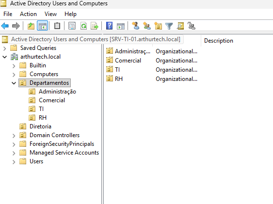
</p>

---

## Etapa 2 - Ingresso da WKS-TI-01 no domínio

Depois de configurar o endereço IP estático da estação e definir o DNS apontando para o controlador de domínio, ingressei a `WKS-TI-01` no domínio `arthurtech.local`.

<p align="center">
  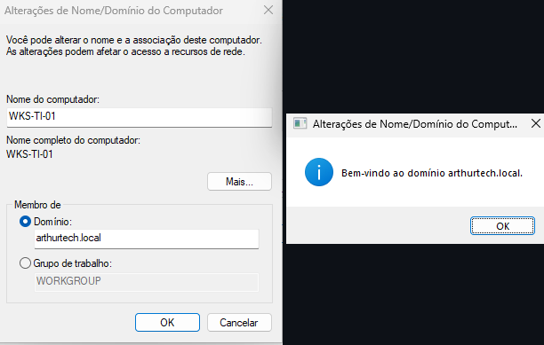
</p>

---

## Etapa 3 - Organização da estação na OU TI

Depois de adicionar a estação ao domínio, movi a `WKS-TI-01` da OU padrão `Computers` para a OU `TI`, deixando o ambiente preparado para a aplicação de GPOs nos próximos laboratórios.

<p align="center">
  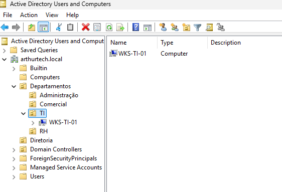
</p>

---

## Etapa 4 - Criação das contas padrão

Para evitar configurar cada usuário manualmente, criei uma conta padrão desabilitada em cada departamento. Essas contas servem como modelo para criar os usuários de cada departamento usando o recurso **Copy** do Active Directory.

Em cada conta configurei previamente horários de logon, restrição de estações (`Log On To`) e demais opções da conta. Dessa forma, todos os usuários do mesmo departamento já são criados com as mesmas configurações.

<p align="center">
  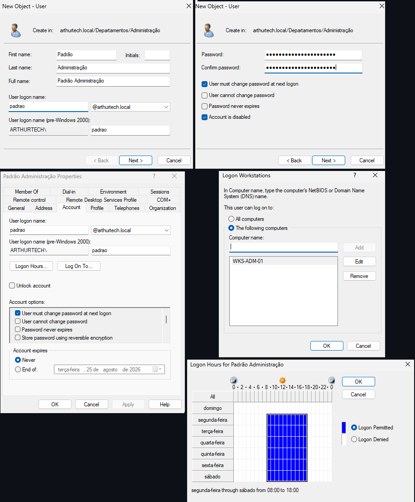
</p>

### Resultado das contas padrão criadas para cada departamento:

<p align="center">
  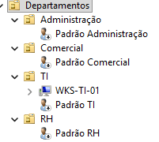
</p>

---

## Etapa 5 - Criação dos usuários da Diretoria

Como a Diretoria possui apenas dois usuários, optei por criá-los manualmente em vez de utilizar uma conta padrão.

Arthur Fernandes (Fundador e Diretor) e Carlos Martins (Sócio Diretor — nome fictício) representam a Diretoria, então deixei o logon liberado para qualquer estação do domínio.

<p align="center">
  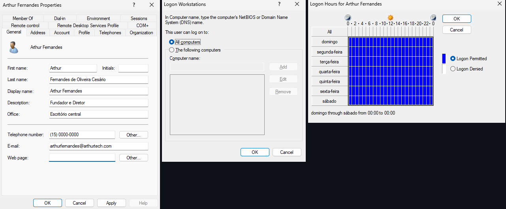
</p>

<p align="center">
  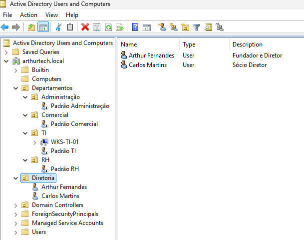
</p>

---

## Etapa 6 - Provisionamento dos usuários

Com as contas padrão prontas, utilizei o recurso **Copy** para criar os usuários de cada departamento, alterando apenas nome, sobrenome e senha.

Na OU `TI`, utilizei o campo **Description** para identificar quais usuários pertencem à equipe de Infraestrutura e quais fazem parte do Suporte Técnico.

<p align="center">
  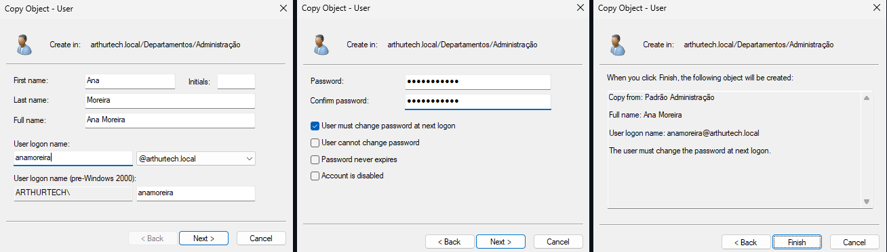
</p>

### Resultado final dos usuários criados:

<p align="center">
  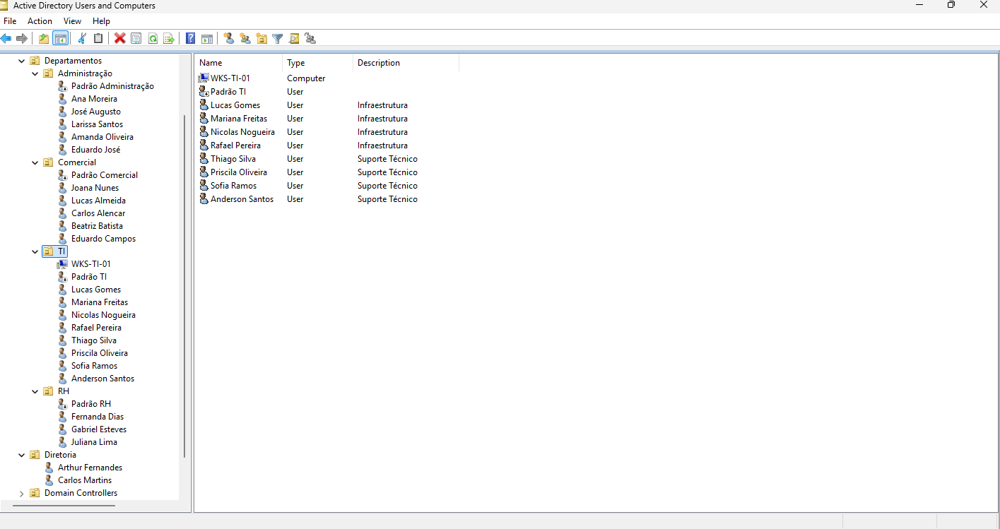
</p>

---

## Etapa 7 - Criação dos grupos de segurança

Criei todos os grupos como **Global** e **Security**. Cada departamento recebeu seu próprio grupo. No caso da TI, optei por manter grupos separados para `Infraestrutura` e `Suporte Técnico`.

Não adicionei as contas padrão aos grupos, já que elas servem apenas como modelo para criação dos usuários.

<p align="center">
  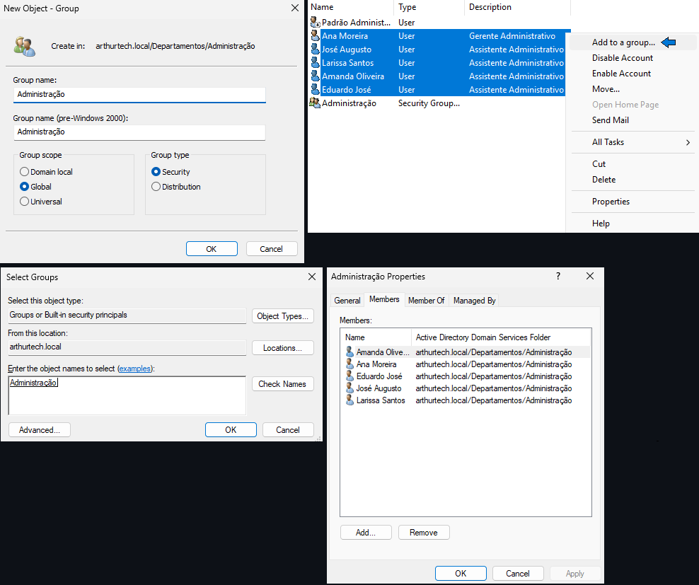
</p>

### Estrutura final de departamentos e grupos:

<p align="center">
  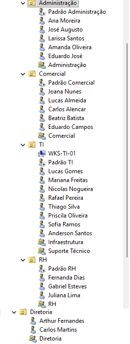
</p>

---

## Etapa 8 - Validação da troca obrigatória de senha

No primeiro logon com o usuário Lucas Gomes (TI), o Windows solicitou a alteração da senha antes de liberar o acesso ao domínio.

<p align="center">
  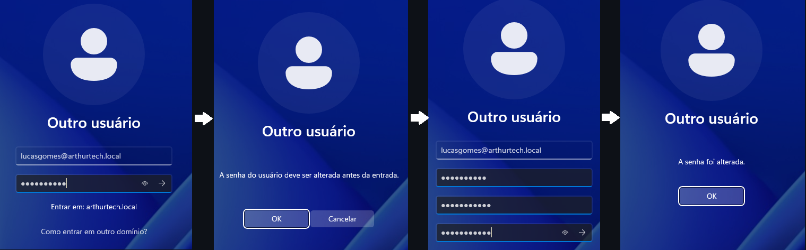
</p>

<p align="center">
  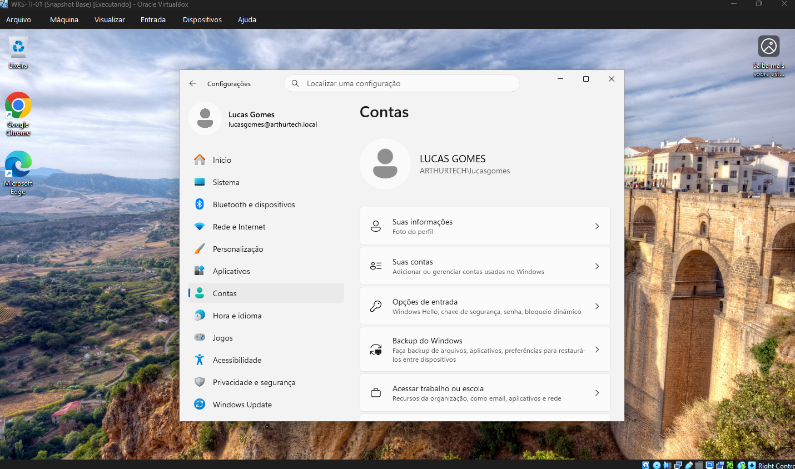
</p>

---

## Etapa 9 - Validação da restrição de logon por estação

Para validar a restrição por estação de trabalho, utilizei a conta de Ana Moreira, pertencente ao departamento de `Administração`, e tentei realizar logon na `WKS-TI-01`.

<p align="center">
  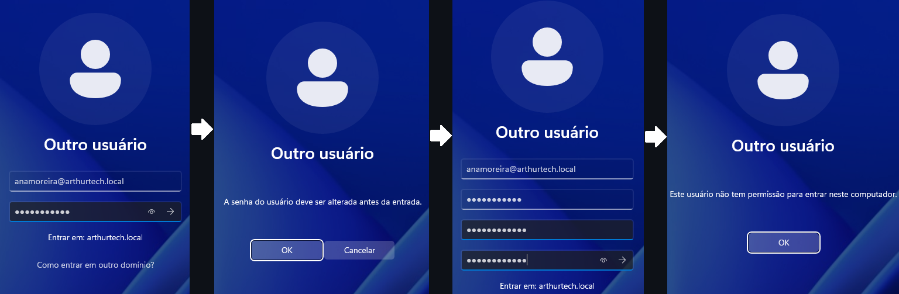
</p>

Durante esse teste descobri um comportamento que eu não esperava. No teste com a usuária Ana Moreira, o sistema primeiro solicitou a alteração da senha e só depois informou que ela não tinha permissão para acessar a `WKS-TI-01`.

Isso mostrou que o Windows verifica a troca obrigatória da senha antes de aplicar a restrição de logon configurada em `Log On To`.

---

## Conclusão

Com esse laboratório, o domínio `arthurtech.local` passou a ter uma estrutura organizada de OUs, usuários e grupos de segurança, pronta para receber GPOs, permissões NTFS e compartilhamentos de rede nos próximos laboratórios.

Além de organizar essa estrutura, também validei a troca obrigatória de senha e a restrição de logon por estação, confirmando que as configurações estavam funcionando como esperado.

## Autor

**Arthur Fernandes**

Estudante de Ciência da Computação, em transição de carreira para a área de TI (Suporte Técnico, Infraestrutura, Redes e NOC).

**LinkedIn:**
[Arthur Fernandes](https://www.linkedin.com/in/arthur-fernandes-289395272)
