<h1 align="center">Storage Pools, File Server e Permissões no Active Directory</h1>

## Objetivo

Neste laboratório implementei um ambiente de armazenamento no `SRV-TI-01` utilizando Storage Spaces, compartilhamento de pastas, permissões NTFS baseadas em grupos do Active Directory e cotas de disco com FSRM.

É a continuação direta do [`02-organizacao-usuarios-grupos-active-directory`](../02-organizacao-usuarios-grupos-active-directory), onde já estavam configurados o domínio `arthurtech.local`, as OUs, os usuários e os grupos de segurança.

## Cenário

O domínio `arthurtech.local` agora precisa de um servidor de arquivos para centralizar o armazenamento da empresa. Além do compartilhamento das pastas por departamento, o ambiente também deve restringir o acesso aos dados mais sensíveis, como RH e Financeiro, utilizando grupos do Active Directory, permissões NTFS e cotas de armazenamento.

## Tecnologias utilizadas

- Windows Server 2025
- Storage Spaces (Storage Pools, discos virtuais)
- Windows PowerShell (diagnóstico)
- Compartilhamento SMB e permissões NTFS
- Active Directory (grupos de segurança)
- FSRM (File Server Resource Manager)

---

## Etapa 1 - Arquitetura de armazenamento

Em vez de criar um Storage Pool por departamento, optei por separar o armazenamento conforme a sensibilidade dos dados:

- **Pool-Confidencial:** pastas `RH-Sigiloso` e `Financeiro`, com acesso restrito.
- **Pool-Operacional:** pastas `TI`, `Comercial`, `Administracao` e `Publica`, utilizadas no dia a dia pelos demais setores.

---

## Etapa 2 - Criação dos discos e dos pools

Criei quatro discos virtuais VDI de 10 GB no `SRV-TI-01`, dois para cada Storage Pool.

<p align="center">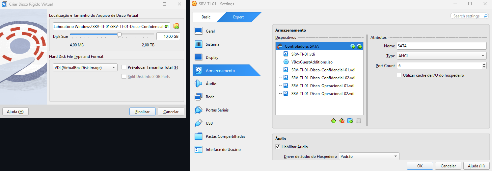</p>

Ao tentar criar os pools pela interface gráfica, o Server Manager só reconhecia 1 dos 4 discos disponíveis, mesmo o PowerShell confirmando os 4 com `CanPool = True`.

<p align="center">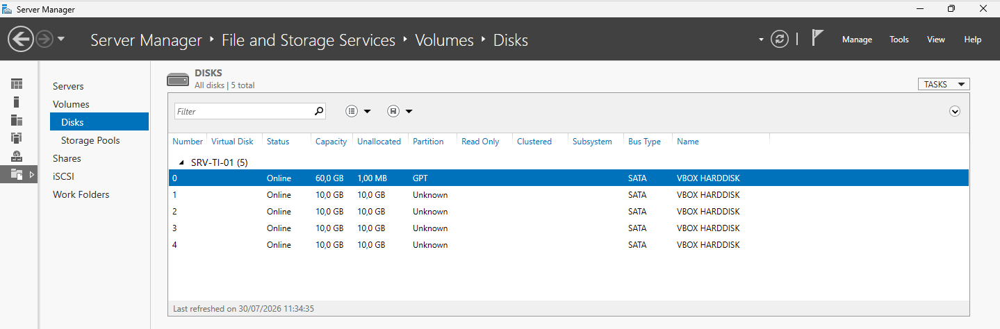</p>
<p align="center">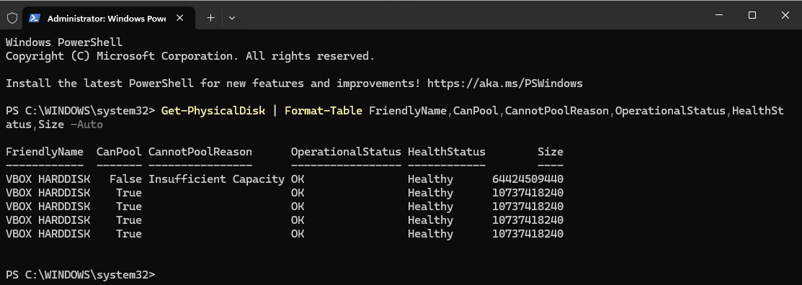</p>
<p align="center">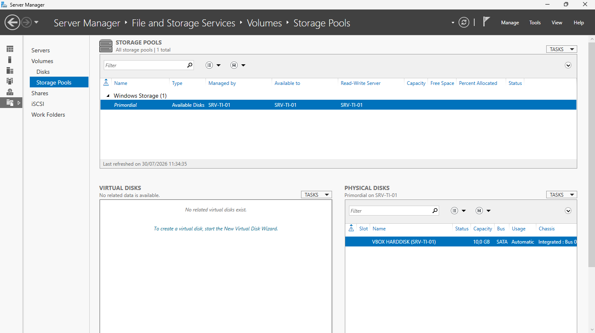</p>
<p align="center">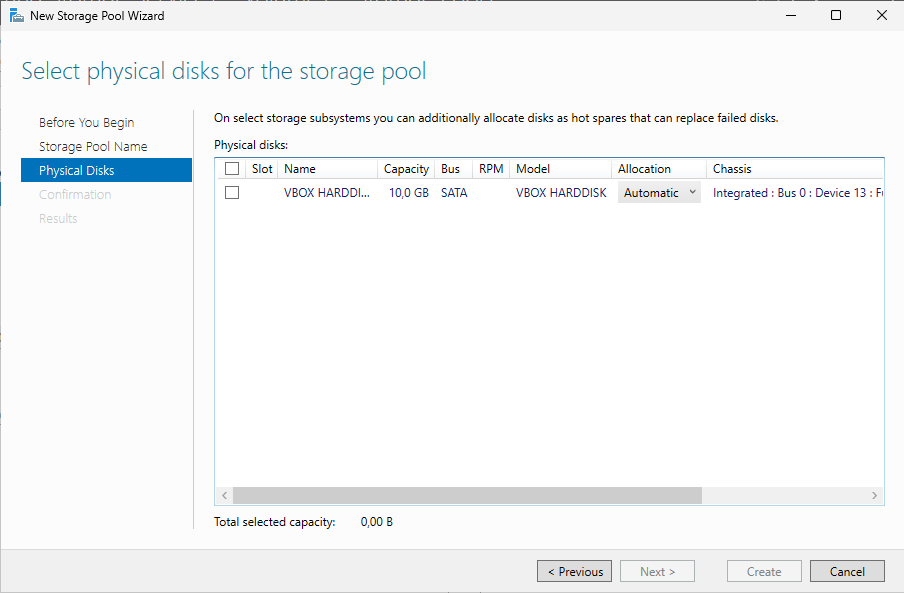</p>

Investigando o problema, comparei o `DeviceId`, `UniqueId` e o `SerialNumber` dos discos:

```powershell
Get-PhysicalDisk | Select FriendlyName, DeviceId, UniqueId, SerialNumber
```

Percebi que os quatro discos possuíam o mesmo `UniqueId`, apesar de cada um ter um `SerialNumber` diferente.

<p align="center">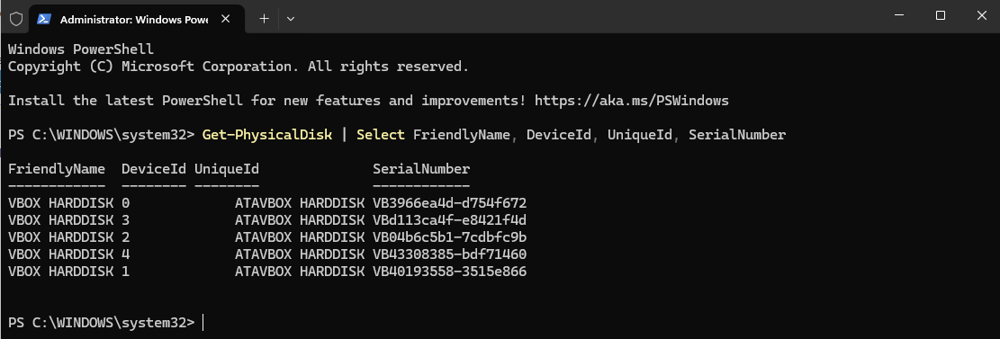</p>

**Observação:** o Server Manager não reconhecia corretamente todos os discos disponíveis. Após pesquisar alternativas para esse comportamento, encontrei uma forma de criar os Storage Pools utilizando o PowerShell. Apliquei os comandos abaixo para concluir essa etapa e os registrei aqui para documentar o procedimento utilizado neste laboratório.

```powershell
$disks = Get-PhysicalDisk -CanPool $true

New-StoragePool -FriendlyName "Pool-Confidencial" `
  -StorageSubSystemFriendlyName "Windows Storage on SRV-TI-01" `
  -PhysicalDisks ($disks | Where-Object DeviceId -in @("1","2"))

New-StoragePool -FriendlyName "Pool-Operacional" `
  -StorageSubSystemFriendlyName "Windows Storage on SRV-TI-01" `
  -PhysicalDisks ($disks | Where-Object DeviceId -in @("3","4"))
```

<p align="center">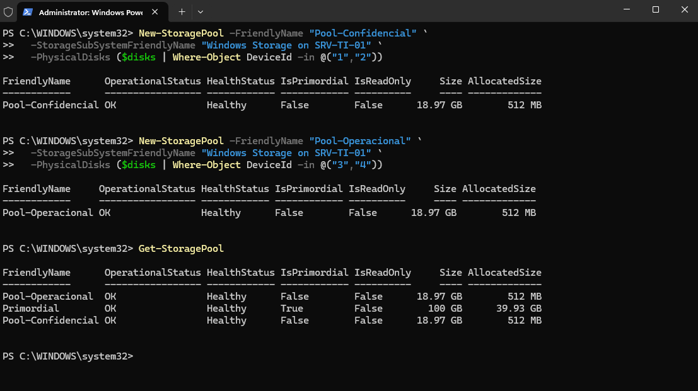</p>

---

## Etapa 3 - Discos virtuais e volumes

Inicialmente pretendia utilizar o layout Mirror no `Pool-Confidencial`, mas essa opção não ficou disponível utilizando apenas dois discos virtuais de 10 GB.

Por esse motivo utilizei o layout Simple nos dois pools.

Em um ambiente real, adicionaria mais discos para implementar um volume em Mirror no `Pool-Confidencial`. 

<p align="center">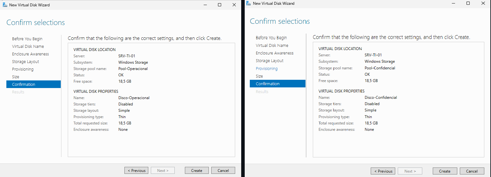</p>

Em seguida criei os volumes, formatados em NTFS: `(E:)Confidencial` e `(F:)Operacional`.

<p align="center">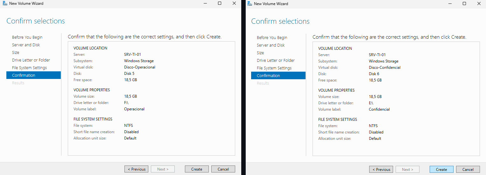</p>
<p align="center">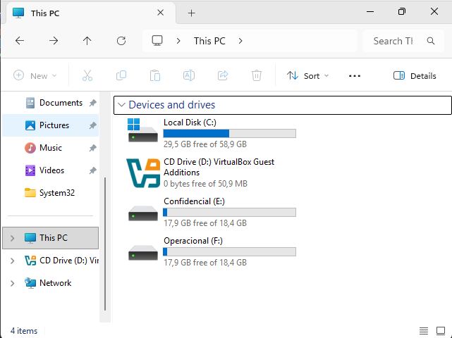</p>

---

## Etapa 4 - Estrutura de pastas

Dentro de cada volume, criei uma pasta por área:
- `E:\Financeiro`, `E:\RH-Sigiloso`
- `F:\Administracao`, `F:\Comercial`, `F:\TI`, `F:\Publica`

<p align="center">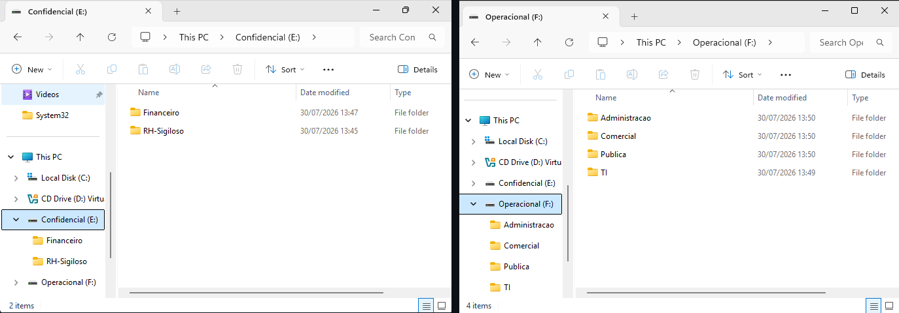</p>

---

## Etapa 5 - Compartilhamento e permissões

Compartilhei cada pasta via SMB (perfil Quick), aplicando permissão de compartilhamento e NTFS pelos grupos de segurança do AD já existentes. As pastas `Financeiro` e `RH-Sigiloso` foram compartilhadas utilizando o caractere `$`, fazendo com que não apareçam na navegação pela rede.

O controle de acesso continua sendo realizado pelas permissões de compartilhamento e pelas permissões NTFS.

Grupos com Full Control em cada pasta:
- **Administracao**: Administração, Diretoria
- **Comercial**: Comercial, Diretoria
- **TI**: TI (Infraestrutura + Suporte Técnico), Diretoria
- **Publica**: Domain Users (Change), Diretoria (Full Control)
- **Financeiro$**: Diretoria
- **RH-Sigiloso$**: RH, Diretoria

A Diretoria tem acesso elevado a todas as pastas, refletindo a decisão tomada no laboratório anterior de não usar Domain Admins, e sim permissões pontuais pra demonstrar o princípio do menor privilégio.

<p align="center">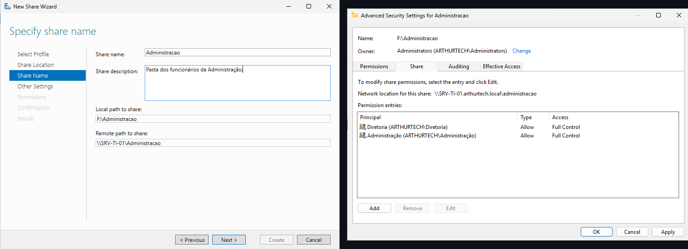</p>
<p align="center">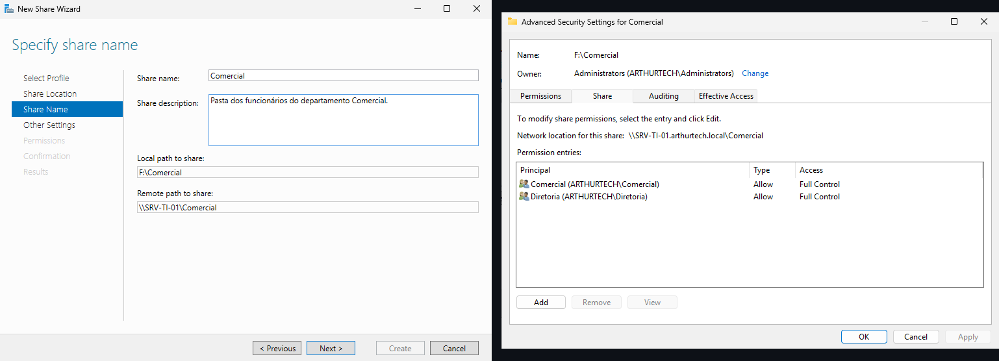</p>
<p align="center">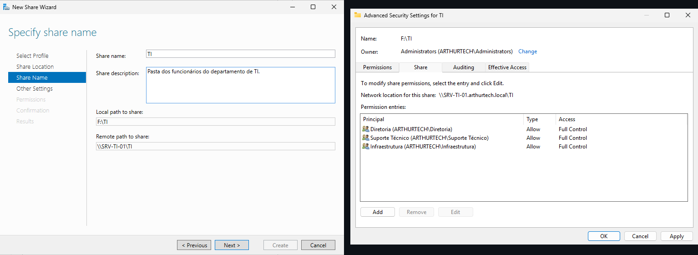</p>
<p align="center">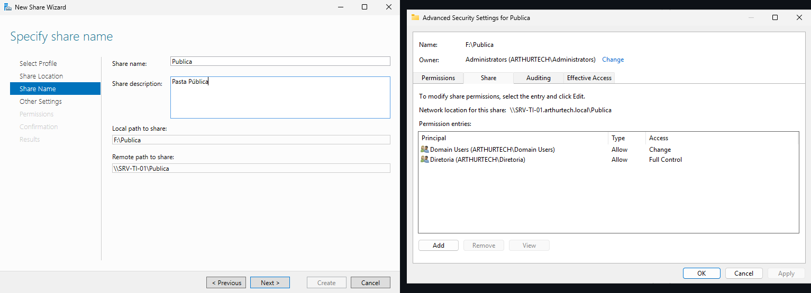</p>
<p align="center">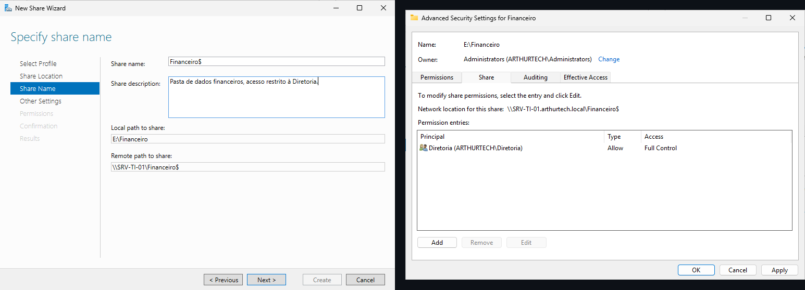</p>
<p align="center">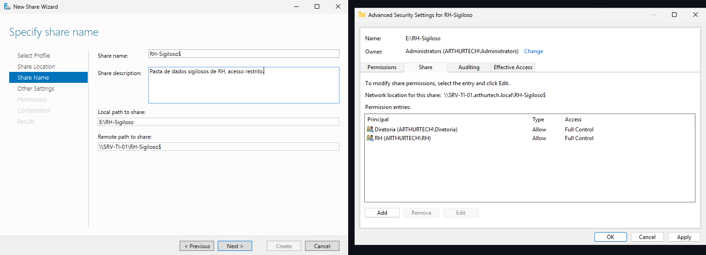</p>
<p align="center">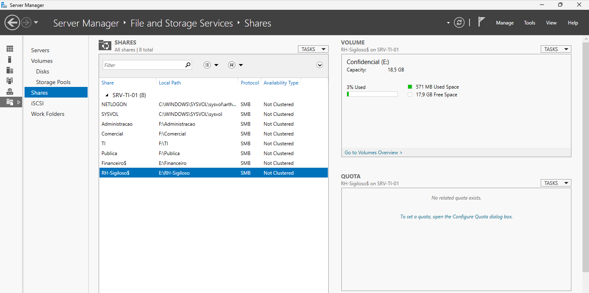</p>

---

## Etapa 6 - Cotas com FSRM

Mesmo `Financeiro` e `RH-Sigiloso` estando no mesmo `Pool-Confidencial`, configurei cotas diferentes para cada pasta utilizando o FSRM.

- `Financeiro`: 10GB (Hard)
- `RH-Sigiloso`: 5GB (Hard)

<p align="center">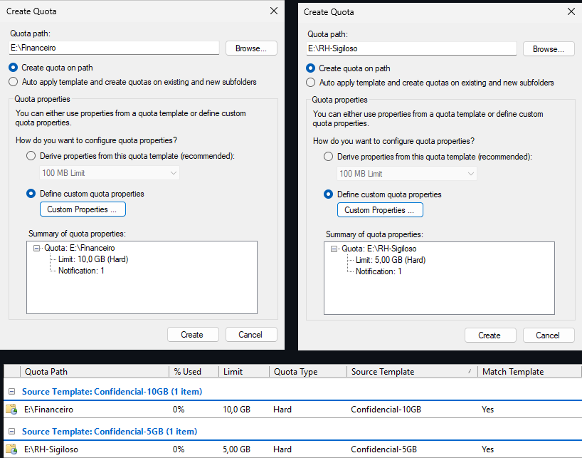</p>

---

## Etapa 7 - Testes de acesso

Testei o acesso com dois usuários reais do domínio, logados no `WKS-TI-01`.

**Priscila Oliveira (grupo TI)**: acesso permitido à própria pasta (`TI`), negado nas demais (`Administracao`, `Financeiro$`, `RH-Sigiloso$`).

<p align="center">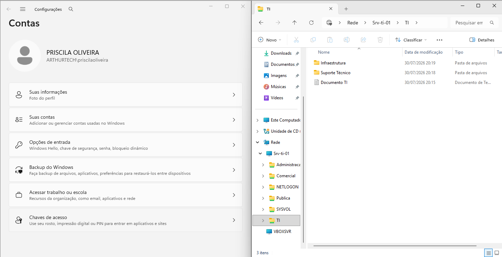</p>
<p align="center"></p>
<p align="center">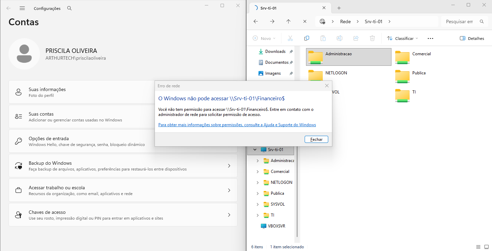</p>
<p align="center">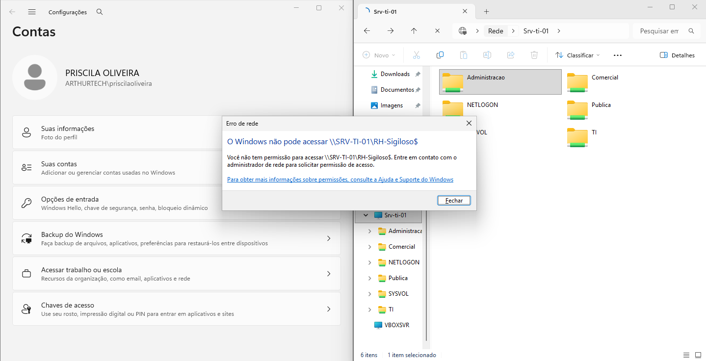</p>

---

**Arthur Fernandes (Diretoria)**: acesso permitido em todas as pastas testadas, confirmando a permissão elevada configurada.

<p align="center">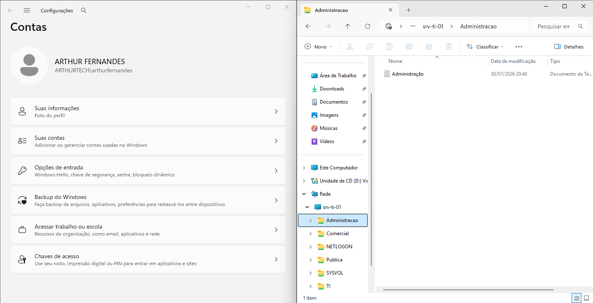</p>
<p align="center">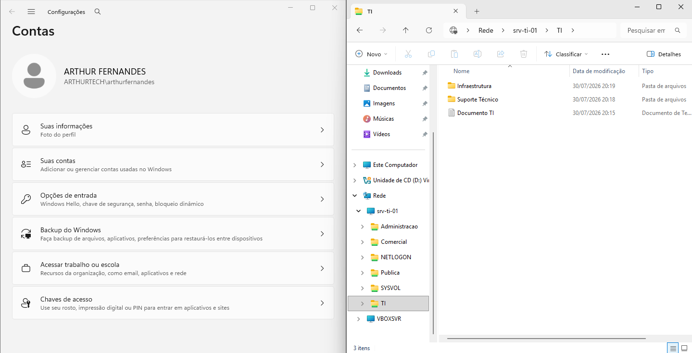</p>
<p align="center">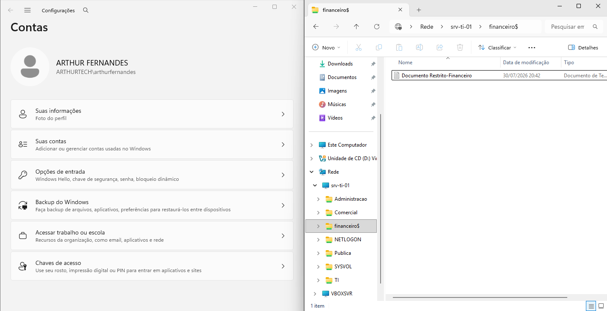</p>
<p align="center">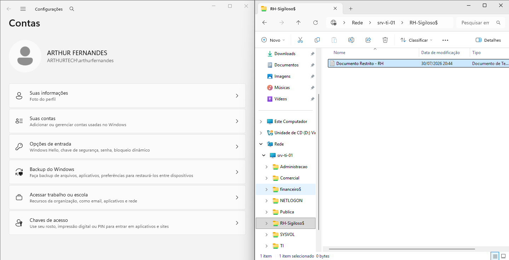</p>

Os testes com `Financeiro$` e `RH-Sigiloso$` foram realizados informando o caminho UNC diretamente, já que esses compartilhamentos não aparecem durante a navegação pela rede.

Mesmo conhecendo o caminho, apenas os grupos autorizados conseguiram acessar as pastas.

---

## Etapa 8 - Snapshot final

<p align="center">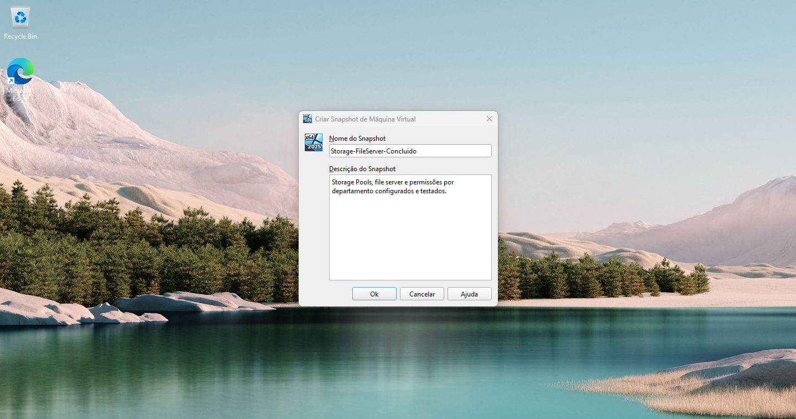</p>

Snapshot `Storage-FileServer-Concluido`, criado após a validação dos compartilhamentos, permissões e testes de acesso, antes de iniciar o próximo laboratório de GPO.

---

## Conclusão

Esse laboratório saiu do plano original assim que tentei criar os Storage Pools: o Server Manager reconhecia só um dos quatro discos disponíveis, mesmo o PowerShell confirmando que todos estavam aptos. Investigando o problema, encontrei uma alternativa via PowerShell pra concluir a configuração dos pools.

Além disso, reutilizei toda a estrutura criada no laboratório anterior, aplicando os grupos de segurança do Active Directory diretamente nas permissões das pastas compartilhadas. Os testes realizados na estação `WKS-TI-01` confirmaram que cada usuário acessava apenas os recursos permitidos para seu grupo.

Com esse laboratório concluído, o ambiente ficou preparado para o próximo passo: mapear automaticamente esses compartilhamentos utilizando Group Policy.

## Autor

**Arthur Fernandes**

Estudante de Ciência da Computação, em transição de carreira para a área de TI (Suporte Técnico, Infraestrutura, Redes e NOC).

**LinkedIn:**
[Arthur Fernandes](https://www.linkedin.com/in/arthur-fernandes-289395272)
