<h1 align="center">GPO: Mapeamento de Unidades de Rede e Políticas de Segurança</h1>

## Objetivo

Este laboratório dá continuidade ao laboratório [Storage Pools e File Server](https://github.com/arthurfernandes97/portfolio/tree/main/laboratorios/laboratorios-windows/03-windows-server-storage-file-server), onde os compartilhamentos de rede por departamento foram criados no `SRV-TI-01`. Aqui o objetivo é usar o Group Policy Management para automatizar o acesso a esses compartilhamentos, aplicar políticas de senha e bloqueio de conta, e restringir o acesso ao Painel de Controle para usuários comuns, tudo aplicado à estrutura de OUs e grupos já existente no domínio `arthurtech.local`.

## Tecnologias utilizadas

- Windows Server 2025 Datacenter Evaluation
- Active Directory Domain Services
- Group Policy Management Console (GPMC)
- Group Policy Preferences (Drive Maps)
- Windows 11 (estação cliente)
- VirtualBox

## Cenário

O ambiente reaproveita a mesma estrutura dos laboratórios anteriores: `SRV-TI-01` como controlador de domínio do `arthurtech.local`, e `WKS-TI-01` como estação de trabalho ingressada no domínio, usada para os testes de aplicação das políticas.

---

## Etapa 1 - Criação da GPO de Mapeamento de Unidades

Criei a GPO `Mapeamento-Compartilhamentos` vinculada na OU `Departamentos`, e comecei a configurar os Drive Maps em User Configuration → Preferences → Windows Settings.

Antes de chegar nesse formato, testei uma abordagem diferente: criar uma GPO separada para cada OU de departamento, vinculada diretamente nela. Funcionava, mas gerava uma GPO por departamento sem necessidade. Optei então por uma única GPO com item-level targeting, filtrando por grupo de segurança dentro dos próprios itens de Drive Map, o que deixa a administração mais centralizada.

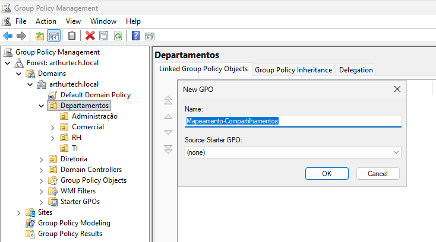

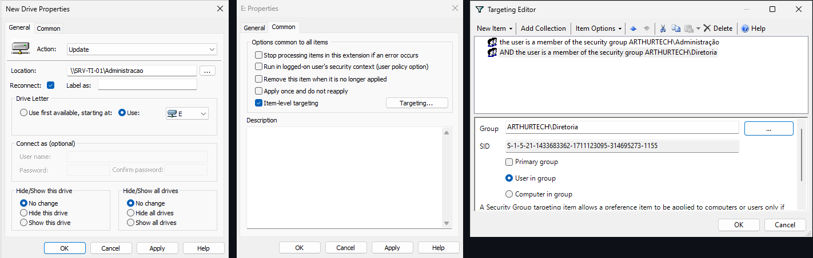

---

## Etapa 2 - Item-Level Targeting por Departamento

Configurei um Drive Map para cada compartilhamento:

- `Administracao` → grupo Administração
- `Comercial` → grupo Comercial
- `TI` → grupos Infraestrutura e Suporte Técnico
- `Publica` → sem targeting (compartilhamento aberto a Domain Users)
- `RH-Sigiloso$` → grupo RH
- `Financeiro$` → grupo Diretoria

Nesse processo, tive dois erros reais que valem registrar.

O primeiro foi tentar colocar mais de um grupo no mesmo campo do seletor de objetos (ex: `Infraestrutura; Suporte Técnico`), o que o Windows não aceita. A correção foi criar um item de targeting separado para cada grupo.

O segundo, mais importante, foi o operador lógico entre os itens de grupo. Ao adicionar múltiplos grupos no mesmo drive, por padrão, o operador lógico entre eles é **AND**, o que exige que o usuário seja membro de todos os grupos ao mesmo tempo para receber o mapeamento, algo que na prática nunca acontece. Troquei o operador para **OR** em cada item com mais de um grupo, incluindo o grupo Diretoria em todos os drives departamentais (já que a Diretoria tem acesso liberado a todos os compartilhamentos, conforme configurado no laboratório de File Server).

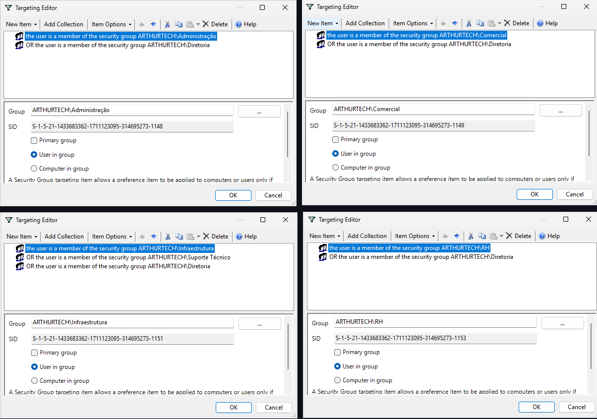

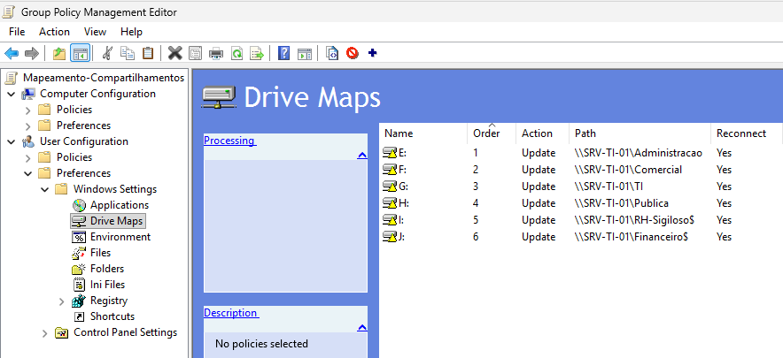

---

## Etapa 3 - Vínculo da GPO na OU Diretoria

Depois de configurar o targeting incluindo o grupo Diretoria, percebi que o mapeamento ainda não chegava aos usuários da Diretoria. O motivo é que a GPO estava vinculada apenas na OU `Departamentos`, e a OU `Diretoria` fica separada, direto na raiz do domínio. Como a GPO estava vinculada apenas à OU Departamentos, os usuários da OU Diretoria não recebiam essa política.

Corrigi vinculando a mesma GPO também na OU `Diretoria`, sem duplicar nenhuma configuração.

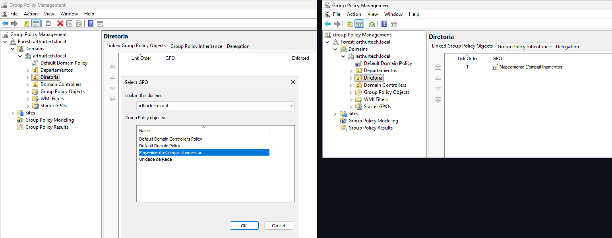

---

## Etapa 4 - Política de Senhas

Configurei a Password Policy na Default Domain Policy com os seguintes parâmetros:

| Configuração | Valor |
|---|---|
| Enforce password history | 24 senhas |
| Minimum password length | 10 caracteres |
| Password must meet complexity requirements | Enabled |
| Maximum password age | 42 dias |
| Minimum password age | 1 dia |

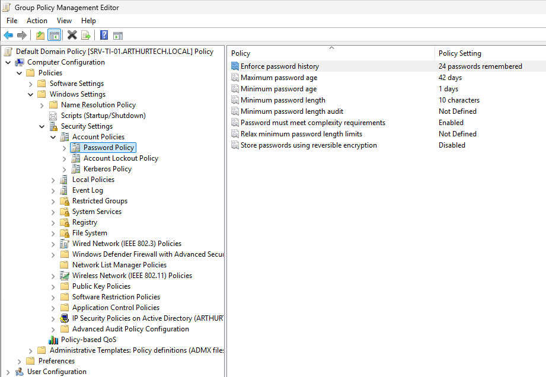

---

## Etapa 5 - Política de Bloqueio de Conta

Como complemento à política de senhas, configurei a Account Lockout Policy, para proteger contra tentativas de força bruta:

| Configuração | Valor |
|---|---|
| Account lockout threshold | 5 tentativas inválidas |
| Account lockout duration | 30 minutos |
| Reset account lockout counter after | 30 minutos |
| Allow Administrator account lockout | Enabled |

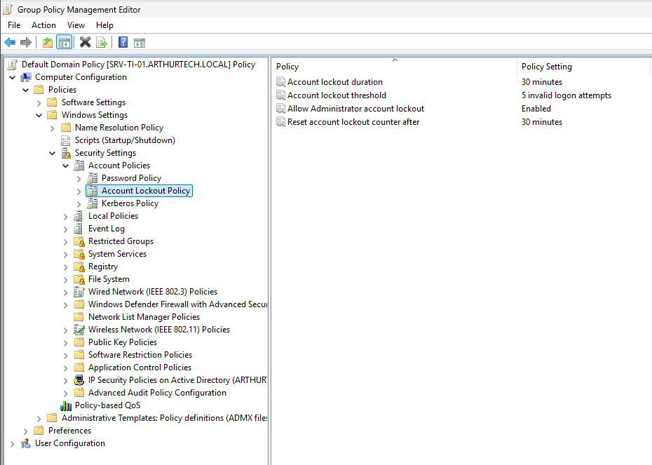

---

## Etapa 6 - Restrição de Painel de Controle

Criei uma segunda GPO, `Restricoes-Departamentos`, vinculada na OU `Departamentos` (não na Diretoria), com a política "Prohibit access to Control Panel and PC settings" habilitada em Administrative Templates. O objetivo é impedir que usuários comuns alterem configurações do sistema, mantendo esse acesso disponível apenas para a Diretoria.

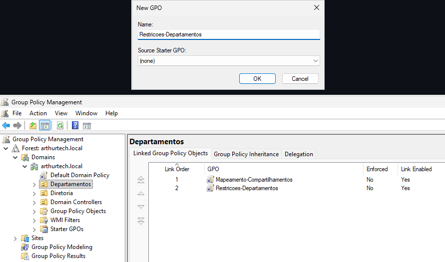

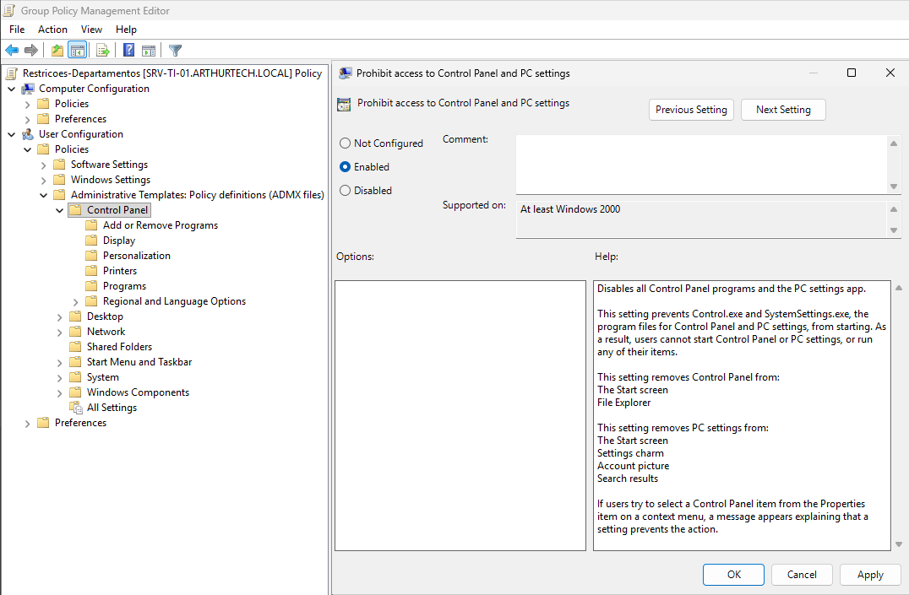

---

## Etapa 7 - Teste com Usuária do Departamento de TI

Fiz o login na `WKS-TI-01` com a usuária Priscila Oliveira (grupo TI), executei `gpupdate /force` para atualizar as políticas, e validei o resultado: o drive de rede do TI apareceu mapeado corretamente, e a tentativa de abrir o Painel de Controle foi bloqueada pela GPO de restrição.

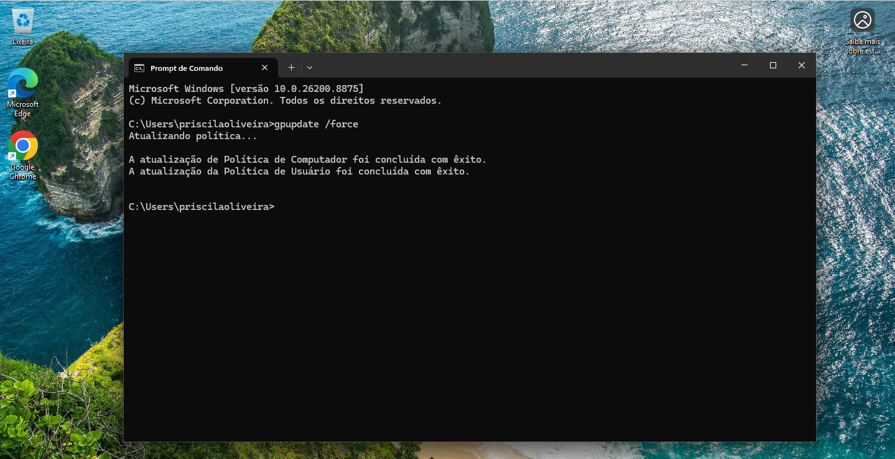

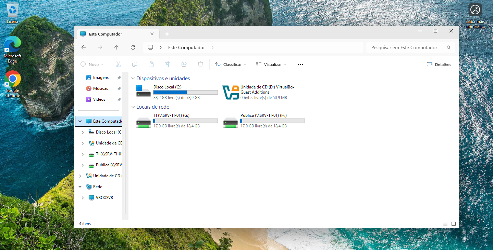

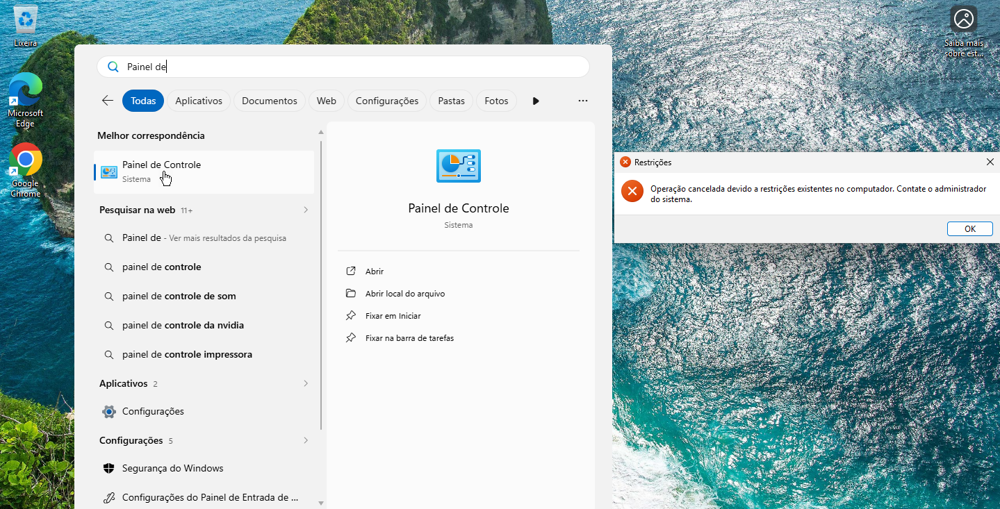

---

## Etapa 8 - Teste com Usuário da Diretoria

Repeti o teste logando como o diretor, para validar os dois pontos que diferenciam a Diretoria dos demais departamentos: o acesso a todos os compartilhamentos (incluindo os confidenciais) e a ausência da restrição de Painel de Controle.

O usuário recebeu os seis drives mapeados, incluindo `Financeiro$` e `RH-Sigiloso$`, confirmando que o operador OR no targeting está funcionando. O Painel de Controle abriu normalmente, confirmando que a GPO de restrição, vinculada só na OU Departamentos, não afeta a Diretoria.

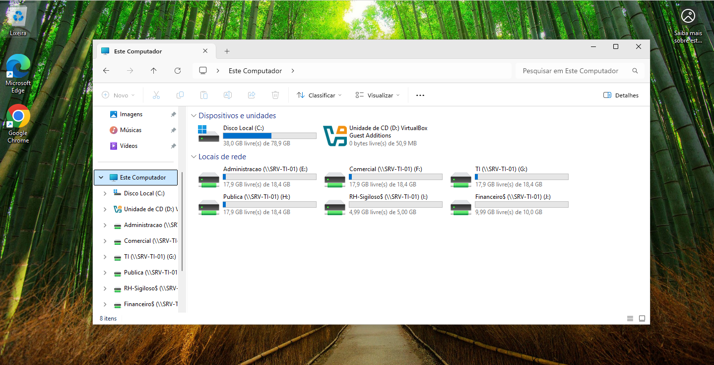

---

## Etapa 9 - Snapshot final

Após concluir a configuração das GPOs e validar os testes de funcionamento, criei um snapshot da máquina virtual para preservar esse estado do ambiente antes de iniciar o próximo laboratório.

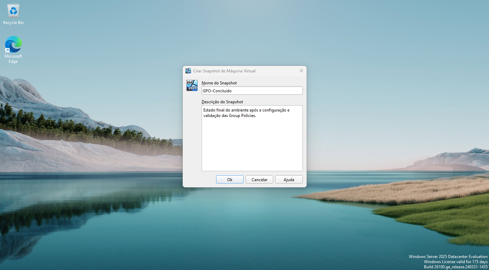

---

## Conclusão

Esse laboratório complementou o ambiente Windows Server que venho construindo desde a criação do domínio. Com o Active Directory, o File Server e agora o GPO, o ambiente reflete um cenário real de infraestrutura corporativa: usuários e grupos organizados por departamento, controle de acesso a recursos, automação de configurações por meio de políticas de grupo e políticas de segurança de conta.

Os dois erros documentados no processo (o operador AND/OR no item-level targeting e a GPO não vinculada na OU da Diretoria) mostram bem o tipo de detalhe que só aparece testando de verdade, não só seguindo um passo a passo.

## Autor

**Arthur Fernandes**

Estudante de Ciência da Computação, em transição de carreira para a área de TI (Suporte Técnico, Infraestrutura, Redes e NOC).

**LinkedIn:**
[Arthur Fernandes](https://www.linkedin.com/in/arthur-fernandes-289395272)
